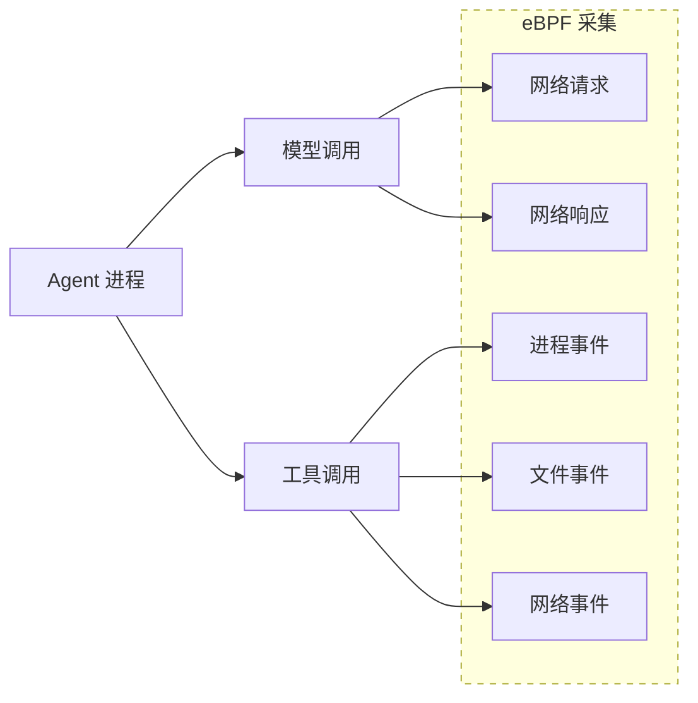
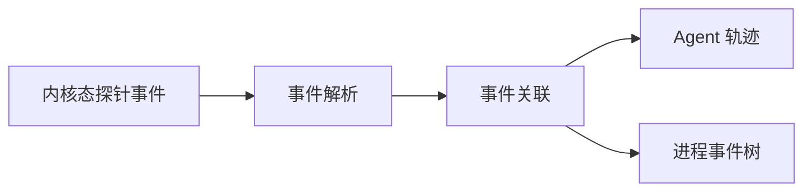

# 第 13 章　Agent 的可观测性

## 13.1 Agent 为什么需要可观测性 

AI 原生应用正在从以模型调用为中心的简单问答系统，演进为能够理解目标、规划步骤、调用工具并持续改变外部状态的 Agent 系统。一次任务的最终结果，往往由 Agent 编排、模型推理调用、上下文处理、知识检索、工具执行以及底层运行环境共同决定。任何一个环节出现偏差，都可能表现为响应变慢、成本增加、任务失败，或者输出看似合理但实际不可用。

因此，AI 原生应用的生产运行不能只回答“服务是否可用”，还需要回答“Agent 实际执行了什么”“问题发生在哪个步骤”“异常结果由哪一次模型或工具调用引起”，以及“应用层现象是否与推理引擎或执行环境有关”。这正是 AI 可观测性需要解决的核心问题。

### 13.1.1 AI可观测性的定义与边界

可观测性是通过指标、日志、Trace 和事件等运行数据，理解 AI 原生应用内部状态和执行行为的能力。它在传统可观测性的基础上引入 Agent、模型、工具、上下文和任务等语义，使观测平台能够还原 AI 任务的执行过程并解释异常结果。

本章主要讨论生产运行阶段的 AI 可观测性，范围覆盖 Agent 应用及其依赖的模型服务、AI 网关、推理引擎和执行沙箱，重点关注过程可见、异常定位以及性能和成本归因。它不等同于模型训练监控，也不同于使用 AI 分析传统运维数据的 AIOps。

目前，OpenTelemetry 已将模型调用、Agent 操作、指标和事件纳入生成式 AI 语义约定[OpenTelemetry GenAI Semantic Conventions](https://github.com/open-telemetry/semantic-conventions-genai/blob/main/docs/gen-ai/README.md)，但相关规范仍在演进。AI 可观测平台既需要兼容开放标准，也需要具备语义扩展能力。

### 13.1.2 AI原生应用的观测挑战

与传统应用相比，AI 原生应用的观测难点不仅来自数据采集本身，还来自行为的不确定性、执行过程的动态性、技术生态的异构性以及观测数据的敏感性。这些特点贯穿 Agent、模型、工具和基础设施等多个层次，使观测体系需要同时解决场景覆盖、语义统一和跨层关联等问题，主要体现在以下方面：

*   **异常与任务质量难以界定。** 即使输入相同，模型也可能生成不同响应，Agent 也可能选择不同的工具或执行路径。Agent 的问题还可能表现为错误规划、无效检索、工具误用，或者任务表面完成但结果不符合预期，因此“请求成功”并不等同于“任务成功”。
    
*   **动态执行路径难以完整还原。** 一次任务可能包含多轮模型调用、并行工具执行、子 Agent 协作和异步回调，执行步骤及其数量在运行前并不完全确定。仅依赖固定服务拓扑或单层调用链，难以表达不同步骤之间的先后关系和因果关系。
    
*   **外部依赖的可见性受限。** 托管模型服务、第三方工具以及外部检索与知识库服务通常只暴露有限的请求与响应信息。问题发生时，需要结合 AI 网关、推理引擎、工具服务和运行环境的遥测数据，才能进一步判断问题来源。
    
*   **跨步骤与跨会话上下文难以关联。** 单个模型调用可能没有明显异常，但放在完整会话或任务中，却可能是一次重复调用、无效重试或异常循环。观测数据既要记录单个步骤，也要维持请求、轮次、会话与任务之间的关联。
    
*   **异构场景难以统一纳管和表达。** AI 与 Agent 应用可能采用不同的开发语言、Agent 框架、模型 SDK 和工具协议，并以传统服务、容器、Coding Agent、桌面客户端、托管 Agent、Serverless 任务或沙箱进程等形态运行。不同场景能够暴露的观测接口和数据粒度并不一致，如何实现统一纳管并建立兼容多种采集方式的公共语义，是 AI 可观测落地的重要挑战。
    
*   **观测完整性、成本与安全难以平衡。** Prompt、模型响应、工具参数、检索文档和执行结果具有较高的存储与处理成本，也可能包含用户数据、业务数据或访问凭证。观测系统需要在信息完整性、采集开销和数据安全之间取得平衡。
    

### 13.1.3 AI可观测性的核心维度与观测对象

AI 可观测性需要明确两个基本问题：一是“看什么”，即从哪些维度判断 Agent 的运行状态；二是“看哪里”，即需要覆盖哪些观测对象。

观测维度主要包括：

*   **运行表现：** 关注任务是否完成，以及输出是否符合预期。
    
*   **稳定性与性能：** 关注错误、超时、重试、异常循环和执行延迟。
    
*   **成本与效率：** 关注 Token 消耗、模型与工具调用成本，以及资源使用效率。
    
*   **行为审计：** 关注关键操作是否被完整记录，并能够追溯其主体、过程和结果。
    

观测对象按照运行层次可以分为：

*   **任务与交互层：** 包括用户请求、消息轮次、会话和任务。
    
*   **Agent执行层：** 包括 Agent、工作流、模型调用、检索和工具调用等执行步骤。
    
*   **AI基础设施层：** 包括 AI 网关、推理引擎、执行沙箱，以及相关 Pod 和 GPU 资源。
    

上述维度和对象需要通过指标、日志、Trace 和事件等观测数据建立关联，使问题能够从任务结果逐步定位到具体执行步骤或基础设施状态。

## 13.2 AI原生应用的观测接入

### 13.2.1 AI可观测数据采集架构

AI 原生应用的技术栈、运行环境和部署形态差异较大，很难依靠一种探针覆盖全部对象。自研 Agent 可以在代码和框架内部埋点，Coding 与通用 Agent 往往只能利用 Hook、插件、会话日志或本地数据库，AI 网关和推理引擎通常提供服务端指标与访问日志，工具、执行沙箱、Pod 和 GPU 则需要结合运行时事件、节点采集和 eBPF 获得实际执行事实。因此，统一采集架构并不要求所有对象采用相同的接入方式，而是允许多种采集入口并存，在汇聚过程中统一传输协议、执行语义和关联标识。


整体架构可以划分为以下四层：

*   **被观测对象层。** 覆盖高代码 Agent 应用、Coding 与通用 Agent、AI 网关、推理服务、MCP 与工具服务、执行沙箱，以及承载这些组件的 Pod、容器、主机和 GPU。不同对象提供的信息并不相同，应用侧最了解任务目的和执行语义，服务端能够提供请求处理与资源调度状态，运行时采集则用于证明进程、文件、网络和资源层面实际发生的行为。
    
*   **采集接入层。** 根据对象能力选择应用内显式埋点、框架或模型 SDK 自动插桩、进程级探针、Hook 与适配器、独立 Daemon、服务端原生遥测、日志解析、Kubernetes 接收器、节点 Agent 或 eBPF。多种方式可以组合使用，例如由应用插桩记录 Agent、LLM 和 TOOL 语义，再由 eBPF 补充未被应用捕获的模型访问、外部工具调用、网络请求和进程行为。组合采集时应根据原生调用 ID、时间边界和数据来源进行去重，避免对同一次操作重复创建 Span 或累计 Token。
    
*   **统一处理层。** 统一采集网关部署在可观测平台服务端，作为各类采集端的统一数据入口，通过可观测业界标准协议 OTLP 等接收应用探针、Hook 适配器、Daemon 和基础设施采集组件上报的遥测数据。网关及其后续处理管道负责协议适配、批处理、语义规范化、属性补充、采样、过滤和脱敏，并将数据路由至对应的存储系统。对于不同框架和服务产生的数据，需要统一 Agent、模型、工具、沙箱和资源等字段的含义，同时保留数据来源及实际值、估算值等必要信息，为后续查询与分析提供一致的数据基础。
    
*   **存储与分析层。** Trace、Metrics、日志和事件可以进入各自适合的存储系统，并通过共同标识建立联合查询，而不必强行写入同一种数据模型。上层分析面向单次执行还原、稳定性与性能监控、Token 和成本分析、任务效果评估、行为审计、动态拓扑及跨层诊断等场景。原始内容与聚合指标可以采用不同的保存周期和访问范围，使诊断能力与数据体量、隐私风险之间保持平衡。
    

不同类型的遥测数据在架构中承担互补作用：

*   **Trace** 记录一次请求或 Agent 活跃执行中的因果关系，将应用入口、Agent 编排、模型调用、检索、工具调用、AI 网关、推理服务和沙箱执行串联起来。对于沙箱内执行的脚本或命令，Trace 还应继续关联具有诊断价值的子进程、文件操作、网络访问和下游服务调用，避免观测链路停留在“命令执行成功”这一表面结果。
    
*   **Metrics** 用于持续观察请求量、错误率、耗时、Token、成本、队列、资源利用率和采集链路健康度等聚合趋势。指标标签应使用模型、工具类型、服务、环境和结果等可控维度，不宜直接使用 Session ID、Trace ID、tool-call ID 等高基数字段。
    
*   **日志与事件** 保存消息摘要、错误栈、策略判定、进程退出、文件和网络活动、沙箱生命周期及控制面变更等细节。对于数量大、粒度细、不适合逐一创建 Span 的运行时行为，可以保留为事件或日志，并通过 Trace ID、Span ID、tool-call ID、沙箱实例和进程标识在 Trace 视图中下钻查询。
    

在这一总体架构下，后续小节分别说明高代码应用的埋点与插桩、Coding 与通用 Agent 的 Hook 和 Daemon 采集，以及基于 eBPF 的无侵入运行时观测。实际部署时可以按应用可改造程度组合这些方式，而不需要在三者之间进行单一选择。

### 13.2.2 高代码应用埋点与插桩

高代码应用是指能够修改应用代码、启动方式或工作负载配置的自研应用，以及基于 LangChain、LangGraph、AgentScope 等框架构建的 Agent 应用。与只能从进程、网络或日志侧旁路观测的场景相比，高代码应用可以在业务入口和执行边界主动建立 Span，因而能够把用户请求、Agent 规划、模型推理、检索和工具执行还原为具有父子关系的任务轨迹。

以一次 Agent 任务为例，建议形成“`ENTRY → AGENT/WORKFLOW → STEP → LLM/RETRIEVAL/TOOL`”的基本层级。入口 Span 记录会话、用户和任务上下文；Agent 或工作流 Span 表示一次编排；Step 表示计划、执行、反思等阶段；叶子 Span 分别表示模型、检索或工具调用。每个 Span 除开始时间、结束时间和状态外，还应按需记录模型与供应商、Token 用量、工具名、参数摘要、结果摘要、重试、超时、阶段序号、完成原因等属性。业务主键、租户、渠道和实验分组等需要跨步骤使用的字段，可在入口写入 Baggage 并随上下文传播；只属于单个操作的字段应写在对应 Span 上，避免把高基数或敏感数据无差别复制到整条链路。

Python 应用通常有三种接入方式。三者不是互斥的产品形态，而是从“语义最强、改造较多”到“接入统一、改造较少”的不同选择。

#### 方式一：通过 LoongSuite GenAI Utils 手动埋点

对于自主开发的 Agent、尚未被探针支持的框架，或者需要准确表达任务目标、规划阶段和业务结果的应用，推荐使用原生 OpenTelemetry SDK进行手动埋点。开源的 LoongSuite GenAI Utils 在 OpenTelemetry 的 SDK 基础上进行了包装，它面向大模型与 Agent 场景封装了统一的 Span 名称、属性、指标和事件语义，应用不需要从普通 OpenTelemetry Span 开始自行约定字段。其 `ExtendedTelemetryHandler` 直接提供 Entry、Agent、ReAct Step、LLM、Tool、Embedding、Retrieval、Rerank 和 Memory 等操作，并负责相应 Span 的创建、结束、错误记录和指标统计。组件定位、安装方式及接口说明参见[LoongSuite GenAI Utils 文档](https://github.com/alibaba/loongsuite-python/blob/main/util/opentelemetry-util-genai/README-loongsuite.rst)。

LoongSuite GenAI Utils 默认不采集 Prompt、模型回复等消息正文；只有在完成数据分类、脱敏、权限和保存期限评估后，才应按需启用消息内容或 GenAI Event 采集。这样可以在保留模型、Token、耗时、状态等结构化观测信息的同时，降低敏感内容泄露和遥测体积失控的风险。

下面以 Python 为例，展示完整任务中 Entry、Agent、ReAct Step、LLM 和 Tool 的嵌套关系埋点方式。`with` 上下文既定义执行边界，也保证正常结束或抛出异常时能够正确收尾；在退出上下文之前，将模型响应、Token 用量、工具参数和结果写回 Invocation，Utils 会将其转换为统一的 GenAI 属性和指标。

```python
from opentelemetry.util.genai.extended_handler import (
    get_extended_telemetry_handler,
)
from opentelemetry.util.genai.extended_types import (
    EntryInvocation,
    ExecuteToolInvocation,
    InvokeAgentInvocation,
    ReactStepInvocation,
)
from opentelemetry.util.genai.types import (
    InputMessage,
    LLMInvocation,
    OutputMessage,
    Text,
)


def run_task(request):
    # 在 Provider 初始化完成后再获取 Handler，避免模块导入期绑定到默认 Provider
    handler = get_extended_telemetry_handler()

    entry = EntryInvocation(
        session_id=request.session_id,
        user_id=request.user_id,
    )
    with handler.entry(entry):
        # 决定 Span 名称与 Baggage 的字段必须在创建 Invocation 时传入
        agent = InvokeAgentInvocation(
            provider="dashscope",
            agent_name="order-agent",
            input_messages=[
                InputMessage(
                    role="user",
                    parts=[Text(content=request.text)],
                )
            ],
        )
        with handler.invoke_agent(agent):
            step = ReactStepInvocation(round=1)
            with handler.react_step(step) as current_step:
                llm = LLMInvocation(
                    provider="dashscope",
                    request_model="qwen-plus",
                    input_messages=[
                        InputMessage(
                            role="user",
                            parts=[Text(content=request.text)],
                        )
                    ],
                )
                with handler.llm(llm) as current_llm:
                    response = call_model(request.text)
                    # 结果类字段在退出上下文前写回 Invocation
                    current_llm.output_messages = [
                        OutputMessage(
                            role="assistant",
                            parts=[Text(content=response.text)],
                            finish_reason=response.finish_reason,
                        )
                    ]
                    current_llm.input_tokens = response.input_tokens
                    current_llm.output_tokens = response.output_tokens

                tool = ExecuteToolInvocation(
                    tool_name="query_order",
                    tool_call_arguments={"order_id": request.order_id},
                )
                with handler.execute_tool(tool) as current_tool:
                    result = query_order(request.order_id)
                    current_tool.tool_call_result = result

                current_step.finish_reason = "completed"
            return result
```

通过 Utils 直接编写上下文管理器适合数量有限、语义明确的核心编排代码。对于重复出现的业务函数，可以将 `handler.react_step()`、`handler.execute_tool()` 等能力封装成装饰器，例如用 `@observe_step(round=1)` 标记一次规划迭代，用 `@observe_tool("query_order")` 包装工具函数。装饰器不是另一套埋点协议，其内部仍调用 LoongSuite GenAI Utils，只是统一完成 Invocation 创建、参数摘要、返回值和异常处理。它适合函数边界与观测边界基本一致的方法；对于生成器、流式响应和后台任务，不能在函数返回迭代器时就结束 Span，而应将 Utils 上下文保持到流结束、取消或失败。

Web 应用可以在 WSGI/ASGI 中间件中调用 `handler.entry()`，从请求头、身份信息或请求体中提取 `session_id`、`user_id` 和业务入口信息，为后续 Agent、模型及工具调用建立统一根节点。`EntryInvocation` 会把 `session_id`、`user_id` 写入 Baggage，并可配合 BaggageSpanProcessor 将这些属性传播到链路中的子 Span；其他租户、渠道或实验分组字段也可采用业务属性染色机制传播。

基于 Agent 框架构建的应用还可以在框架回调中接入 LoongSuite GenAI Utils：在 Agent、Chain、LLM、Retriever 和 Tool 的开始事件中进入对应的 Handler 上下文，在结束或错误事件中补充结果并退出上下文。回调机制适合框架已经提供稳定生命周期事件、但自动插桩尚未覆盖，或者需要附加业务字段的场景。实现时应以框架提供的 run\_id 及 parent\_run\_id 保存 Invocation 和上下文关系，不能仅按线程号关联，以兼容异步调用、并行分支和子 Agent。对于流式模型调用，还应在首个有效响应块到达时记录首 Token 时间，并在流结束后写入完整的用量、完成原因和输出摘要。

手动埋点与框架自动插桩可以组合，但必须避免重复建模。如果探针已经为同一次模型、检索或工具调用生成 Span，手动埋点应主要补齐 Entry、Agent、Step 和业务结果，或者在当前 Span 上增加必要属性，不应再创建一个语义相同的 LLM 或 Tool Span。这样既保留自动插桩的低接入成本，也能利用 LoongSuite GenAI Utils 建立完整的业务执行层级。

#### 方式二：在进程启动时自动插桩

进程级自动插桩适用于 Java、Go、Node.js、Python 等多种语言。当应用采用探针已支持的 Web、HTTP、数据库、模型 SDK 或 Agent 框架时，可以通过相应语言的探针减少业务代码改造。以下仍以 Python 为例：开源的 [LoongSuite Python](https://github.com/alibaba/loongsuite-python) 是基于 OpenTelemetry Python 构建的发行版，并增强了对常用 AI Agent 框架的支持。应用安装 `loongsuite-distro` 后，可以通过 `loongsuite-bootstrap` 安装匹配的 Instrumentation，再使用 `loongsuite-instrument` 启动应用。探针会在业务模块加载前初始化 Provider 和已安装的 Instrumentation，对受支持组件的方法进行包装，自动创建 Span、注入和提取上下文并导出遥测数据。Uvicorn、Gunicorn、uWSGI、gevent 等不同启动方式需要分别验证初始化顺序与运行兼容性。

```shell
pip install loongsuite-distro opentelemetry-exporter-otlp
loongsuite-bootstrap -a install --latest --auto-detect
export OTEL_SERVICE_NAME=order-agent
export OTEL_EXPORTER_OTLP_ENDPOINT=http://otel-collector:4317
export OTEL_EXPORTER_OTLP_PROTOCOL=grpc
loongsuite-instrument --traces_exporter otlp python app.py
```

这种方式的“手动”是指手动安装和修改启动命令，应用内部的组件埋点仍然是自动完成的。其优势是代码改动少，能统一覆盖 HTTP 入口与出口、数据库访问以及受支持的模型 SDK 和 Agent 框架，并自动维持基础调用关系；局限是覆盖范围受探针版本、依赖版本、导入顺序和启动模型约束。自动插桩通常能够识别“调用了哪个模型或框架方法”，却无法凭技术调用推断“为什么调用”“当前属于哪个业务阶段”“结果是否满足业务目标”。因此生产实践中常采用“探针采集通用依赖 + LoongSuite GenAI Utils 补充业务语义”的混合方式。

框架自动插桩本质上也是探针插件。插件可以在不修改框架源码的情况下包装稳定的公共方法，或者接入框架原生回调，将框架对象转换成统一的 GenAI Span。现有插件未覆盖自研框架时，可基于 OpenTelemetry `BaseInstrumentor` 编写扩展，对模型客户端或工具执行器的稳定入口进行包装；应声明依赖版本范围，并处理同步、异步、流式、异常和取消路径。

#### 方式三：在 K8s 中自动注入探针

对于部署在 Kubernetes 中的大量应用，可以在集群中部署 Operator 或同类接入组件，并通过工作负载标签或注解启用观测。组件在 Pod 创建阶段为符合条件的工作负载准备并注入探针及配置，使团队无需逐个修改应用镜像或启动命令。Operator 可以根据工作负载语言交付对应探针，例如为 Python 应用交付 LoongSuite Python，并为 Java、Go、Node.js 应用配置相应的自动插桩组件。[OpenTelemetry Operator](https://opentelemetry.io/docs/platforms/kubernetes/operator/automatic/) 展示了基于 Kubernetes 准入机制完成自动插桩注入的通用实现。阿里云商业化组件 [ack-onepilot](https://help.aliyun.com/zh/ack/product-overview/ack-onepilot) 则面向 ACK、ACS 等 Kubernetes 场景提供相应商业探针的接入与管理能力。

集群自动注入解决的是探针交付和配置治理问题，注入后实际的数据采集仍由进程内探针及其插件完成，因此它与方式二具有相同的框架兼容边界，也不能替代业务语义埋点。它适合应用数量多、镜像由多个团队维护、希望统一升级和开关探针的 Kubernetes 环境；对于非容器应用、启动生命周期极短的任务、受限运行时，或者不允许注入初始化容器的工作负载，应改用进程级安装、LoongSuite GenAI Utils 手动埋点或其他采集方式。上线前还需要验证初始化耗时和资源配额，并通过灰度工作负载检查探针与依赖版本的兼容性。

三种方式的覆盖范围与适用条件可以概括如下：

| 接入方式 | 主要覆盖范围 | 能表达的语义 | 适用条件与边界 |
| --- | --- | --- | --- |
| LoongSuite GenAI Utils 手动埋点 | 通过 Utils、装饰器、中间件和框架回调覆盖应用入口、任务、Agent、执行阶段、模型、检索、记忆与工具调用 | 最强，提供统一 GenAI 语义，并可记录目标、阶段、业务结果及框架未暴露的信息 | 需要修改和维护代码；必须正确处理上下文、异常、异步及流式生命周期 |
| 进程级 Python 探针自动插桩 | 受支持的 Web/HTTP/数据库/模型 SDK/Agent 框架 | 可自动获取技术属性和部分 GenAI 语义，业务语义有限 | 可修改依赖和启动方式；覆盖程度取决于探针与组件版本兼容性 |
| K8S 集群级自动注入 | 批量为 Kubernetes 工作负载交付并启用上述 Python 探针能力 | 与进程级探针相同，可叠加应用显式埋点 | 需要集群组件、工作负载标签和相应权限；需评估初始化容器的耗时与资源 |

实际选型不应只追求“零代码”。对于框架支持良好、以技术性能监控为主的应用，可先采用对应语言的自动插桩探针，例如 Python 应用可以使用 LoongSuite Python；对于需要还原 Agent 决策过程、区分执行阶段或按业务结果分析的应用，应通过相应语言的 SDK 或 GenAI 语义库增加手动埋点，Python 应用可以使用 LoongSuite GenAI Utils；对于 Kubernetes 中的规模化应用，则由 Operator 统一交付多语言探针，商业化环境也可以采用 ack-onepilot 等接入组件，再在少量关键边界补充业务语义。无论采用哪种方式，都应保证进程内只有一套有效的 TracerProvider 和导出链路，避免对同一次调用重复插桩，并对 Prompt、模型响应、工具参数和检索内容设置按需采集、截断、脱敏、采样和访问控制策略。

### 13.2.3 Coding 与通用 Agent 观测数据采集  

[LoongSuite Pilot](https://github.com/alibaba/loongsuite-pilot) 已支持 Qwen Code CLI、Qoder 系列（Qoder IDE、Qoder CN、Qoder for JetBrains、Qoder CLI、Qoder Work、Qoder Work CN）、Qwen Work CN、Claude Code、Codex、Cursor、Cursor CLI、Grok Build、Kiro CLI、OpenCode、MiMo Code、Pi Coding Agent、DeepSeek Harness、OpenClaw、Hermes Agent、WorkBuddy 和 Wukong 等 Coding 与通用 Agent 的观测数据采集。

这些 Agent 通常以 CLI、IDE 扩展、桌面客户端或独立服务运行，使用方往往只能配置运行环境和扩展接口，难以修改内部实现。不同 Agent 暴露的回调、Hook、transcript、日志和数据库在格式、时间精度及调用标识上存在差异，采集需要将这些来源还原为可关联的执行记录。

承接 13.2.1 的采集架构，Pilot 采用 Agent 侧适配器与独立 Daemon 协同的方式：适配器获取原生执行证据，Daemon 负责增量读取、跨来源补充、语义归一化及输出。适配层处理 Agent 差异，公共管道复用上下文关联、内容过滤和多目标上报能力。

#### 采集入口与数据来源

采集入口应根据 Agent 实际暴露的能力选择。原生回调提供操作边界，生命周期 Hook 记录活动或触发解析，本地记录补充消息、用量与调用身份。三类来源可以组合使用。

| **采集入口** | **主要证据** | **适用方式与边界** |
| --- | --- | --- |
| 原生插件或扩展回调 | 模型请求与响应、工具开始与结束、执行状态 | 在受支持的扩展点采集结构化事件；覆盖范围取决于 Agent 版本和插件 API |
| 生命周期 Hook | 用户输入、工具活动、子 Agent 与轮次结束通知 | 直接记录事件，或写入唤醒标记后解析 transcript；不能假定每个 Hook 都包含模型用量 |
| 本地 transcript、日志或数据库 | 消息、原生调用 ID、模型、Token、持久化时间记录 | 采用文件偏移、记录游标或快照增量读取；需要处理延迟写入、轮转及格式变化 |

Pilot 的接入体现了这种组合：[Qwen Code CLI](https://github.com/alibaba/loongsuite-pilot/blob/f6632f28d06ff2e158c20e7f1c1c73c1ceae48c0/assets/hooks/qwen-code-cli-hook-processor.mjs) 与 [Claude Code](https://github.com/alibaba/loongsuite-pilot/blob/f6632f28d06ff2e158c20e7f1c1c73c1ceae48c0/assets/hooks/claude-code-hook-processor.mjs) 的 Hook 可在 Stop 时解析 transcript；[Codex](https://github.com/alibaba/loongsuite-pilot/blob/f6632f28d06ff2e158c20e7f1c1c73c1ceae48c0/src/inputs/codex-transcript/codex-transcript-input.ts) 由 Hook 唤醒、Daemon 读取 transcript；[OpenClaw](https://github.com/alibaba/loongsuite-pilot/blob/f6632f28d06ff2e158c20e7f1c1c73c1ceae48c0/assets/plugins/openclaw/plugin.mjs) 通过插件回调记录模型与工具活动；[Qoder](https://github.com/alibaba/loongsuite-pilot/blob/f6632f28d06ff2e158c20e7f1c1c73c1ceae48c0/src/inputs/qoder-trace/token-enricher.ts) 则融合会话、数据库或拦截记录，补充模型、Token 和时间信息。

多来源融合应按字段确定权威来源，优先使用原生请求、响应和工具调用 ID 配对。时间接近只能作为受约束的辅助证据。Hook 与 transcript 观察到同一次操作时，应合并处理，避免重复建模或累计用量；缺失、估算和无法匹配的信息应明确标识，不能用零值或猜测值补齐。

#### Hook 与独立 Daemon 协同

适配器在 Agent 进程或其用户环境中提取必要信息并记录到本地，将网络上报、重试和跨来源处理交给 Daemon。Hook 内确需解析 transcript 时，应限制执行时间与数据规模，避免采集失败影响 Agent 的业务结果。


图 13.2.3-1 Coding 与通用 Agent 观测数据采集架构（来源：根据 LoongSuite Pilot 实现绘制）

Daemon 根据目录、配置、命令或进程发现 Agent，按采集准入配置部署适配器，再结合监听与定时扫描增量读取记录，补充工作目录、Git 仓库、用户和服务上下文。Hook 通知只表示有活动或数据变化，读取方仍需确认记录完整，不能据此直接认定一次调用已经结束。

集成管理与状态反馈应分开表达：前者负责受管理的 Hook、插件配置及部署修复，关闭采集或卸载时按集成生命周期清理；后者分别观察 Agent 是否被发现、插件是否加载、输入是否产生事件、输出是否成功。采集准入只控制是否启用采集，不替代 Agent 的业务权限或安全策略。

#### 从遥测事件恢复执行链路

不同来源先归一化为遥测事件（Telemetry Event），再构建 Trace；这里的遥测事件不等同于业务系统定义的 Event。Pilot 记录用户输入、llm.request、llm.response、tool.call、tool.result 等活动，保留原生关联标识、源事件时间、观察时间、模型和用量。用户输入的 other 与 agent.input 属于兼容输出，Trace 转换会排除兼容副本，避免重复建模，具体字段见 [输出事件 Schema](https://github.com/alibaba/loongsuite-pilot/blob/f6632f28d06ff2e158c20e7f1c1c73c1ceae48c0/docs/zh-CN/output-event-schema.md)。

Session、Trace 与 Span 的定义及活跃执行边界见 13.3.1，执行语义见 13.3.2。采集侧的重点是按稳定标识配对请求与响应、调用与结果。图 13.2.3-2 展示 LoongSuite 的一种映射示例，其中 ENTRY、AGENT、STEP 等层级不代表 OpenTelemetry 强制要求的固定结构；只有可靠识别迭代边界时才建立 STEP。


图 13.2.3-2 遥测事件到 Trace 的映射示例（来源：根据 LoongSuite Pilot 事件模型与转换流程绘制）

模型生成的 tool-call 只是调用意图，实际工具执行应由匹配的执行回调或结果记录确认。并行调用按 tool-call ID 分别配对；子 Agent 通过明确的父调用标识关联到发起它的 Agent 或 TOOL，无法可靠关联时保留缺失信息，不凭时间顺序强行嵌套。

轮次结束应依据运行级终止证据，不能等同于单次模型结束。Pilot 对 Codex 使用 transcript 中的完成或中断记录，对 OpenClaw 使用运行级结束 Hook；模型结束后仍可能发生工具执行、重试或子 Agent 活动。跨请求等待与恢复遵循 13.3.1 的边界。执行结束或 Trace 成功只描述技术状态，业务 Outcome 应由业务应用或授权 Verifier 依据成功标准与验收证据判定。

LLM 耗时应尽可能采用原生请求开始与完整流结束时间，TTFT 单独记录请求到首个有效输出的时间。只有 transcript 时间时，应说明它表示响应记录、首个可见输出还是持久化时刻，不能将重建耗时直接解释为精确推理耗时。TOOL 使用实际执行起止边界，采集时间与 Stop 通知时间不能无条件替代。

#### Token 口径与上下文关联

Token 优先采用模型服务或 Agent 暴露的实际用量，保留供应商、模型及缓存分类。Pilot 的输入 Token 总量包含缓存读取和缓存写入，汇总时不能再次相加。同一响应的多个片段或多个来源只能累计一次；累计快照需换算新增用量，缺失用量不能记作零。

业务 Task 承载跨阶段的任务身份，可以跨越多个原生 Session 和多次活跃执行。采集器应保留业务系统提供的 Task 标识及其与原生 Session、turn 的映射，关联缺失时明确标识，不从会话文本或时间邻近关系自行推断。Task、用户及 Session 等高基数字段保留在日志与 Trace 中用于下钻，指标标签采用应用、Agent 类型、模型和结果等可控维度。

上下文关联还需要连接触发 Agent 的应用请求以及工具的下游调用。对于事后重建的 Trace，关联上下文必须在执行时由调用方、Agent 或工具侧保存，事后生成的 Trace ID 不能自动补回已完成的远端调用关系。业务 Session 与 Agent 原生 Session 也应区分，先按原生标识配对，再映射业务身份。

#### 可靠性与采集质量

增量采集需要持久化采集游标与去重状态，用于恢复读取进度；这些状态不等同于业务 Task 在安全点保存的一致状态版本（Checkpoint）。游标只推进到完整且已处理的记录边界，并处理重启、截断、轮转、末尾半条记录及目录暂时不可用。临时读取失败应保留状态，首次接入需明确跳过历史还是回放；并发 Hook 可通过独立文件与原子发布避免覆盖。

读取恢复与远端交付是两种保证。Pilot 的 [常规 Input](https://github.com/alibaba/loongsuite-pilot/blob/f6632f28d06ff2e158c20e7f1c1c73c1ceae48c0/src/inputs/base/base-input.ts) 在发出事件后保存输入状态，不等待远端写入确认；因此游标已保存不代表后端已收到数据，也不能据此承诺端到端不丢不重。需要更强交付保证时，应另行设计持久化待发送队列、交付确认和后端幂等机制。

应配置 Agent 消息内容的采集范围，并对代码、工具参数、结果及凭证执行必要的过滤、脱敏与截断，在存储侧设置访问权限和保留期限。Pilot 的 [默认配置](https://github.com/alibaba/loongsuite-pilot/blob/f6632f28d06ff2e158c20e7f1c1c73c1ceae48c0/src/normalization/agent-config.ts) 开启消息内容采集，生产接入仍应显式选择采集范围，不应将默认值视为无条件保存完整消息的建议。[内容过滤](https://github.com/alibaba/loongsuite-pilot/blob/f6632f28d06ff2e158c20e7f1c1c73c1ceae48c0/src/normalization/agent-content-policy.ts) 在输出前生效；多模态内容采用受控资源引用，并管理本地读取范围与远端访问权限。

验收应从真实 Agent 操作出发，对照原始记录、遥测事件与最终 Trace，覆盖多轮交互、并行工具、取消、错误、子 Agent、重启恢复及关闭内容采集。重点检查调用配对、时间边界、Token 去重和后端写入结果，并监控采集延迟、积压与失败数，为后续归因、成本分析和审计提供可判断的数据质量依据。

### 13.2.4 基于eBPF的无侵入运行时观测 

Agent 应用形态多样，SDK 与扩展能力差异较大，导致应用层埋点适配成本高、覆盖效率低。相比之下，Agent 的模型调用与工具执行等关键行为均经由稳定的内核接口，为统一观测提供了基础。基于 eBPF，[AgentSight](https://github.com/alibaba/anolisa/tree/main/src/agentsight)可在这些路径上无侵入地采集运行时数据，并结合协议解析与用户态探针，还原模型调用、工具调用等关键信息。

Agent 的模型调用与工具调用两类关键行为，落到系统层后都表现为可被 eBPF 采集的事件。模型调用对应一次网络请求与一次网络响应：请求侧承载系统提示词、用户输入、历史对话与可用工具定义，响应侧承载模型的思考过程、最终输出、工具调用意图与 token 用量；结合流式响应中逐个增量事件的到达时刻，可进一步得到首 token 延迟（TTFT）、输出 token 间隔（TPOT）与单次调用的端到端耗时。工具调用则对应进程、文件与网络三类事件：进程的创建与退出可还原完整的进程树与命令行参数，文件的读写反映工具对代码与配置的改动，网络事件覆盖工具自身发起的外部访问。上述事件统一携带进程标识与内核时间戳，因此可按进程关系与时序拼接，把模型输出的工具调用意图与随后真实发生的系统行为对应起来，还原成一条完整的 Agent 行为轨迹。两类行为与 eBPF 采集事件的对应关系如下图所示。



从探针事件到可用的观测数据，中间要走一条固定的链路。内核态探针采集的事件批量送入用户态后，先做事件解析，把网络字节流按 HTTP/1.1或者HTTP/2 还原成结构化报文，把进程、文件与网络事件还原成结构化记录；再做事件关联，按连接把请求与响应配成一次完整往返，按父子关系把进程事件串成一棵树。最终输出两份数据：一份是进程事件树，记录每次工具执行的命令与产物；一份是以会话为单位的 Agent 轨迹，按时序记录这次任务里发生的模型调用与工具执行。处理链路如下图所示。



## 13.3 Agent全链路观测分析

Agent 的一次运行通常不是单一的模型请求，而是由任务理解、计划生成、模型推理、知识检索、工具调用和结果生成等多个步骤共同组成。对于多 Agent 应用，一次任务还可能包含任务委派、并行执行和结果汇总。只观察最终响应或单个模型接口，无法判断 Agent 实际执行了哪些步骤，也难以解释任务失败、响应变慢或成本升高的原因。

Agent 全链路观测的目标，是围绕一次实际运行建立完整且可查询的执行记录，将任务结果与中间步骤、错误、延迟和资源消耗关联起来。它并不要求无差别保存所有输入输出，而是要通过统一的链路边界和执行语义，保留足以还原运行过程、比较运行表现和定位问题的观测信息。

### 13.3.1 Agent执行链路的观测模型与边界

Agent 可能在一次会话中经历多次交互，每次交互又可能包含多次模型推理、工具调用、子 Agent 协作和异步等待。如果不区分会话关联范围、单次活跃执行的边界和具体操作，就容易将整个长会话记录为一条持续时间过长的链路，或者将相互关联的多次执行割裂为完全独立的请求。因此，Agent 全链路观测可以使用 Session、Trace 和 Span 建立公共观测模型。

*   **Session** 表示一段连续会话的关联范围，用于聚合用户与 Agent 在多次交互中产生的观测数据。它可以跨越多次请求、多条 Trace，甚至跨越较长的时间间隔。Session 主要回答“这些交互是否属于同一段会话”，而不直接表示一次连续执行，因此不宜将整个 Session 记录为一条长时间不结束的 Trace。
    
*   **Trace** 记录一次外部输入触发的活跃执行过程，用于还原各项操作的顺序、嵌套、并行与因果关系。外部输入可以是用户消息、人工审批结果、回调或异步恢复事件；当 Agent 返回结果、转入跨请求等待，或者因错误和中断停止执行时，当前 Trace 结束。在常见的同步交互中，一次交互通常对应一条 Trace。如果执行通过持久化队列、回调或长时间等待跨越了清晰的运行边界，应在恢复时创建新 Trace，并通过相同的 Session 标识、前序关系或 Trace Link 保留上下文和因果联系。
    
*   **Span** 是 Trace 中的基本执行单元，表示一个具有明确开始、结束和执行结果的可观测操作。多个 Span 通过父子关系和时间关系构成完整调用树：嵌套 Span 表示实际调用关系，同一父节点下时间重叠的 Span 可以表示并行执行。Span 主要回答“执行了什么、花费了多长时间、结果如何，以及由谁调用”。
    

Session 提供跨多次交互的关联范围，Trace 和 Span 表达实际执行过程。三者是逻辑层级关系，不意味着 Session 必须被创建为 Span。实现时，通常使用稳定的 Session 标识关联多条 Trace，再由 Trace ID、Span ID 和父 Span ID 记录具体执行关系；如需表达执行先后或恢复关系，可以补充 Trace 序号、前序 Trace 标识或 Trace Link，而不必再抽象一层公共对象。

典型的逻辑层级如下：

```plaintext
Session
├── Trace 1
│   ├── Span
│   ├── Span
│   └── Span
└── Trace 2
    ├── Span
    └── Span
```

以 Agent 在执行过程中请求用户补充信息为例，用户的初始请求触发 Trace A，Agent 完成若干处理后向用户提问，并在进入跨请求等待时结束该 Trace。用户回答后，新的外部输入触发 Trace B。两条 Trace 使用相同的 Session 标识，并通过前序关系表明后一次执行是对前一次执行的继续。HITL 审批跨请求恢复时也适用相同方式。

```plaintext
Session S1
├── Trace A：用户提出请求，Agent执行后转为等待输入
└── Trace B：用户补充信息，Agent恢复执行并返回最终结果
```

内部重试、模型回退或工具重试如果没有结束当前活跃执行，应保留在同一 Trace 中，并将每次实际调用分别记录。流式输出也属于同一 Trace，Trace 应覆盖从开始处理到流式响应消费完成或被中断的时间。对于 AskUserQuestion 或 HITL，如果等待发生在同一进程内且执行控制权没有释放，可以继续沿用当前 Trace；如果已经返回请求、持久化状态或进入长时间等待，则应结束当前 Trace，并在外部输入重新激活 Agent 时创建新的 Trace。

Span 的划分应优先覆盖对结果、延迟和成本具有实际影响的操作。过粗的 Span 无法定位问题，过细的 Span 又会引入噪声和额外的采集、存储开销。合理的 Span 应具有清晰的操作边界、起止时间、执行状态及上下游关系，具体需要记录哪些 Agent 操作，将在后续执行语义中说明。

### 13.3.2 Agent执行语义

仅有调用关系还不足以理解 Agent 的运行过程。不同 Agent 框架可能使用 Chain、Node、Step、Action 或 Task 等不同术语描述相似操作，如果缺少统一语义，同一类行为会以不同名称进入观测平台，难以进行跨应用查询和聚合分析。Agent 执行语义需要描述链路中实际发生的操作，以及各操作在整次任务中的作用。

| 语义 | 表达的操作 | 观测边界与关系 |
| --- | --- | --- |
| `ENTRY` | AI 应用对一次外部请求或用户交互的完整处理 | 连接协议入口与 Agent 执行过程。一个 Session 可以包含多次 ENTRY，不应将整个长会话记录为一个持续运行的 ENTRY。 |
| `AGENT` | 一次实际的 Agent 调用，覆盖接收输入、规划、调用模型或工具并生成结果的过程 | 同一 Agent 的多次调用应分别记录；子 Agent 也应作为独立调用，并关联其发起方。 |
| `WORKFLOW` | 由多个节点、分支或子流程组成的编排过程 | 用于表达按既定流程组织的整体结构，下层可包含 Agent、步骤和工具调用。 |
| `STEP` | ReAct 循环中的一次推理与行动迭代 | 通常包含一次模型推理及其触发的工具调用。只在框架能够可靠识别 ReAct 轮次时记录，不应将普通工作流节点或任意内部操作统称为 STEP。 |
| `LLM` | 一次真实发往模型的请求 | 工具执行后的再次推理、模型回退和实际发出的重试应分别记录；流式调用应覆盖完整的响应消费过程。 |
| `RETRIEVAL` | 从知识库、搜索系统或其他数据源召回外部信息 | 重点记录查询目标、数据源、返回结果概况、耗时和状态。如果检索由 LLM 作为工具自主发起，实际检索操作应位于对应 TOOL 下。 |
| `MEMORY` | 查询、创建、更新、合并或删除 Agent 记忆 | 仅记录明确的记忆读写和管理操作，不应将模型读取已组装的上下文等同于 MEMORY。如果由记忆工具发起，应位于对应 TOOL 下。 |
| `TOOL` | 一次实际发生的工具执行 | 不表示模型生成的调用意图。每次工具执行应独立记录；审批等待与工具实际执行需要区分，避免将人工等待时间计入工具耗时。 |
| `GUARDRAIL` | 围绕明确对象执行的规则校验、风险检测和策略决策 | 应记录被校验对象、执行阶段、判定结果及放行、阻断、脱敏或改写等处置，并关联其保护的 LLM、TOOL 或 AGENT 操作。 |
| `COMPACTION` | 对会话上下文进行摘要、裁剪、替换或卸载 | 应记录触发原因及压缩前后的规模变化。如果通过模型生成摘要，该 LLM 调用应位于 COMPACTION 下；Trace 只保留压缩事实和结果引用，不重复保存被替换的完整历史。 |
| `HITL` | 工具审批、信息补充、人工审核等需要人员参与的交互 | 应区分等待、恢复、拒绝和终止等状态。跨请求等待时应结束当前 Trace，恢复时创建新 Trace，并通过 Session 标识和前序 Trace 关系关联前后过程。 |
| `INTERRUPT` | Agent、模型或工具在正常完成前被停止 | 应保留中断发起方、原因、发生位置和已产生的有效结果。预期的用户打断不一定属于系统错误，但也不应标记为正常完成。 |

以通用 ReAct Agent 为例，上述语义在一条典型 Trace 中可以形成如下结构：

```plaintext
ENTRY  一次外部请求或用户交互
└── AGENT  主Agent的一次运行
    ├── RETRIEVAL / MEMORY  固定流程触发的操作（可选）
    ├── STEP  ReAct第1轮（可选）
    │   ├── GUARDRAIL  检查LLM输入（可选）
    │   ├── LLM  生成本轮推理与行动
    │   ├── GUARDRAIL  检查LLM输出或工具调用意图（可选）
    │   ├── GUARDRAIL  检查Tool参数与权限（可选）
    │   ├── TOOL  检索或记忆Tool（可选）
    │   │   └── RETRIEVAL / MEMORY  实际检索或记忆操作
    │   ├── TOOL  其他Tool（可选）
    │   │   └── AGENT  由派发Tool启动的子Agent（可选）
    │   └── GUARDRAIL  检查Tool结果（可选）
    ├── STEP  ReAct第2轮（可选）
    │   ├── LLM  基于上一轮观察继续决策或生成结果
    │   └── GUARDRAIL  检查LLM或Agent最终输出（可选）
    ├── COMPACTION  上下文压缩（可选）
    │   └── LLM  生成上下文摘要（可选）
```

该结构只用于说明通用 ReAct Agent 中“推理—行动—观察—继续推理”的典型执行过程，并不是所有 Agent Trace 都必须遵循的固定模板。对于基于 Workflow 的 Agent，Trace 结构应由具体编排内容决定，按照实际的节点顺序、条件分支、并行执行、循环和子流程关系记录。虽然不同 Workflow 的拓扑结构可能存在较大差异，但其中的实际操作通常仍可以映射为 AGENT、WORKFLOW、STEP、LLM、TOOL、RETRIEVAL、MEMORY、GUARDRAIL 等执行语义节点，从而支持跨框架的一致查询和分析。


_Agent执行Trace调用树示例_

该图展示了执行语义在实际 Trace 中的呈现方式，从Entry入口开始，下层记录模型调用、工具执行和 Guardrail 校验等操作；当主 Agent 通过工具派发子 Agent 时，子 Agent 及其后续模型和工具调用继续按照真实调用关系展开。每个节点可以进一步关联耗时、模型、Token、TTFT、输入输出和执行状态等信息，从而由请求概览下钻到具体步骤，定位主要耗时和异常位置。

Trace 的父子结构应反映真实调用关系，而不是为了得到固定树形结构而人为拼接。例如，子 Agent 如果由派发工具启动，应位于对应 TOOL 节点下；并行工具调用则应表现为同一父节点下的多个并列操作。Guardrail 应紧邻被保护操作并明确校验对象和执行阶段，通常与 LLM 或 TOOL 位于同一 STEP 下并按实际顺序排列；如果实现中的真实调用栈存在嵌套，也可以记录为对应操作的子节点。

对于上述语义单元，应使用一致的公共信息描述名称、操作类型、执行状态、起止时间、输入输出摘要和错误，并根据模型、检索、工具等不同操作补充必要属性。语义设计应优先记录系统能够直接观察和验证的事实，包括显式计划、工具选择、状态变化和执行结果，而不把无法稳定获得的模型内部思维过程作为必要字段。涉及 Prompt、模型响应和工具参数时，应根据诊断价值采用摘要、脱敏或按需采集。

### 13.3.3 错误、延迟与运行稳定性观测

Agent 的错误不仅包括接口异常和服务不可用，还包括执行过程中未能正确处理的业务失败。为了准确定位问题，需要区分模型调用错误、检索失败、工具执行错误、参数校验失败、权限拒绝、超时和人工终止等不同类型，并记录错误首次出现的步骤以及后续传播情况。对于工具返回失败但 Agent 继续执行的情况，还需要同时保留工具步骤的失败状态和整个任务的最终状态。

延迟观测需要从请求整体和具体执行步骤两个层次展开。请求端到端延迟反映用户的实际等待时间，步骤耗时则用于解释时间花在了哪里。对于一次典型执行，可以分别观察 Agent 编排、模型调用、知识检索、工具执行和结果整理等阶段的耗时；对于流式模型调用，还可以关注首个有效输出的延迟。通过步骤耗时与调用顺序，可以识别关键路径以及串行等待、慢工具和重复调用等延迟来源。

稳定性问题不一定表现为单次请求失败，也可能体现为错误率、超时率或延迟长尾的持续升高。此类问题通常需要先通过聚合指标发现趋势或异常，再下钻到对应请求的 Trace，查看具体错误位置和步骤耗时。

错误、延迟与运行稳定性应重点关注以下指标：

| 指标类别 | 重点指标 | 观测意义 |
| --- | --- | --- |
| 请求量 | 请求数及请求速率 | 反映 Agent 应用的访问规模和流量变化趋势。 |
| 错误与超时 | 请求错误率、各操作类型错误率、超时率、错误类型占比及首次失败位置分布 | 判断问题集中在 Agent 编排、模型、检索、工具还是安全策略环节。这里只统计可直接观测的执行错误，不将任务是否正确完成纳入该指标。 |
| 端到端延迟 | 请求总耗时的 P50、P95 和 P99，以及首个用户可见输出延迟 | 前者反映一次请求的完整等待时间，后者反映流式交互的用户体感；用户可见首输出与模型首响应需要分开统计。 |
| 步骤延迟 | Agent、LLM、RETRIEVAL、MEMORY、TOOL、GUARDRAIL 和 COMPACTION 等操作耗时的 P50、P95 和 P99 | 识别关键路径、慢步骤、串行等待以及延迟长尾。 |
| 模型性能 | 模型调用耗时、首 Token 时延（TTFT）、平均每输出 Token 时延（TPOT）和 Token 输出速率 | 区分模型整体调用慢、首 Token 返回慢和持续生成慢等不同性能问题。 |

通过这些指标，可以从请求整体、执行步骤和模型生成三个层面识别错误、超时、延迟长尾及模型性能异常等稳定性问题。

### 13.3.4 Token消耗、调用成本与运行效率观测

模型调用是 Agent 运行成本的主要来源之一，其费用通常随模型类型和 Token 用量动态变化。因此，Token 观测需要分别记录输入、输出和缓存 Token，并关联到对应的模型调用及 Agent 执行过程。模型服务能够返回准确用量时，应以服务端数据为准；无法直接获取时，可以基于分词规则进行估算，但应明确标注估算口径，并与实际计费数据区分，避免影响成本核算。

成本分析不能只停留在单次模型调用。一次交互可能调用多个模型或子 Agent，因此需要把各模型调用的使用量和费用汇总到 Trace、Agent 和 Session 层；当业务系统能够提供稳定的任务标识时，还可以进一步汇总到任务层。成本计算需要保留模型、供应商、Token 类型、计价版本和币种等依据，以便重算和审计。

运行效率反映 Agent 为获得有效结果投入了多少调用和资源。除总 Token 和总成本外，还可以观察模型调用次数、工具调用次数、缓存使用情况、无效步骤占比和任务完成前的平均步骤数。只有将成本与任务结果结合，才能区分合理的高成本任务和由重复调用、异常重试或低效路径造成的成本浪费。

Token 消耗、调用成本与运行效率应重点关注以下指标：

| 指标类别 | 重点指标 | 观测意义 |
| --- | --- | --- |
| Token 用量 | 每次 LLM 调用及每条 Trace 的输入 Token、输出 Token、总 Token，以及可获得时的推理 Token | 判断 Token 主要消耗在上下文输入、推理还是最终输出，并识别单次异常值和分布长尾。 |
| 缓存 Token | 缓存读取 Token、缓存写入 Token，以及缓存命中率 | 评估 Prompt 缓存是否有效降低重复输入的计算量与调用费用。缓存命中率可以按缓存读取 Token 占输入 Token 的比例计算；不同供应商的缓存口径不完全一致，应按实际返回语义统计。 |
| 模型调用成本 | 输入、输出、缓存及推理 Token 成本，单次 LLM 调用成本和不同模型的成本占比 | 识别高成本模型、高价 Token 类型以及模型选择策略对费用的影响。 |
| 执行效率 | 每条 Trace 的步骤数、LLM 调用数、工具调用数和 Token 数，以及重复步骤占比 | 判断 Agent 的执行路径是否过长或存在重复调用，用于发现执行膨胀和低效编排。 |

指标维度应优先使用应用、Agent、操作类型、模型、供应商、工具类型、执行结果和环境等低基数字段。Session ID、Trace ID、用户 ID 和动态 Prompt 等高基数内容不宜作为指标标签，应保留在 Trace 或日志中用于下钻查询。

### 13.3.5 任务效果与输出质量观测

传统应用通常可以根据状态码和异常判断请求是否执行成功，但 Agent 请求在技术上成功返回，并不意味着用户目标已经达成。模型可能生成不正确或不完整的答案，检索结果可能与问题无关，工具虽然调用成功却没有产生预期业务结果。因此，任务效果与输出质量不能直接由基础运行指标推断，而需要在 Trace 采集的数据之上执行额外的规则校验、模型评估或人工判断。

观测时可以从三个层次评价 Agent：最终结果评价关注输出是否正确、完整并满足用户要求；关键步骤评价关注检索内容、工具选择、调用参数及子 Agent 路由是否合理；执行轨迹评价关注整个决策和行动路径是否能够支持最终结果，以及是否存在偏离目标或不必要的操作。评价结果应关联到对应的 Session、Trace 或具体 Span，使质量问题能够回溯到实际执行过程，而不是只保存一个与运行链路割裂的总分。

常见的通用评估器包括：

| 评估器 | 主要评价内容 | 适用对象 |
| --- | --- | --- |
| 正确性 | 输出事实、结论或操作结果是否与参考答案、已知事实或校验结果一致 | 最终回答、结构化结果和任务产物 |
| 相关性 | 输出是否直接回应用户请求，检索内容是否与当前问题相关 | 最终回答和检索结果 |
| 完整性 | 是否覆盖请求中的关键问题、约束条件和必要步骤 | 最终回答和任务结果 |
| 有据性 | 输出中的事实和结论是否能够由检索内容、工具结果或给定上下文支持 | RAG、搜索和数据分析类 Agent |
| 指令遵循 | 输出格式、行为约束、角色要求和用户指令是否得到满足 | 最终回答和 Agent 行为 |
| 检索质量 | 召回内容是否相关、充分，并能够为后续回答提供有效依据 | RETRIEVAL Span 及其返回内容 |
| 工具调用正确性 | 工具选择、调用时机和参数是否符合用户目标与当前上下文 | TOOL Span 和单步决策 |
| 轨迹质量 | Agent 的整体执行路径是否合理，是否存在遗漏、偏离或冗余步骤 | 完整 Trace 和多 Agent 协作过程 |
| 安全与合规 | 输出或操作是否违反安全策略、权限边界及合规要求 | 最终输出、模型调用和工具操作 |

不同评估器可以采用不同实现方式。具有明确答案、格式或业务状态的场景，应优先使用确定性规则和业务系统校验；难以通过代码直接判断的语义质量，可以使用 LLM-as-a-Judge；高风险或主观性较强的结果，则需要结合专家复核、用户反馈和人工标注。评估记录至少应保留评估器名称与版本、评价对象、分数或等级、判断理由及证据，并与被评价的 Trace 或 Span 建立关联。生产环境可以采用实时或抽样评估，离线环境则可以复用历史 Trace 和标注样本进行集中分析。

需要注意的是，通用评估器只能提供基础质量信号，无法替代面向具体业务目标的效果评价。Agent 是否真正完成任务、产生了多大业务价值、是否允许替代路径，以及不同错误的影响程度，都与业务流程、数据和风险要求紧密相关。建立这类评估体系通常需要准备代表性样本、定义评价标准与基准答案、校准模型评估器，并持续结合专家反馈迭代，需要投入较多工程和业务专家资源。本书将在调优章节中详细介绍 Agent 评估的方法与实践，本小节仅对其在可观测体系中的位置和基本方式作简要说明。

## 13.4 Agent审计

### 13.4.1 Agent审计的定义与边界

Agent 审计是在可观测数据之上，对 Agent 的身份、授权、执行行为和外部影响进行持续记录、检查与追溯的能力。它要回答的不只是某段模型输出是否“看起来安全”，而是：谁在什么权限下，通过哪个 Agent 发起了什么任务；Agent 调用了哪些模型、数据与工具；实际影响了哪些对象；是否越过用户意图、组织策略或合规边界；结论能否被复核。

Agent 审计与可观测性、评测和 Guardrail 相互关联，但职责不同。可观测性侧重还原“发生了什么、问题在哪里”；评测侧重衡量“任务效果是否达到预期”；审计侧重判断“行为是否合规、责任如何归因、证据是否完整”；Guardrail 则在执行前或执行中实施允许、拒绝、脱敏、审批和限权等控制。事后审计可以发现风险并推动策略改进，但不能撤销已经发生的文件修改、外部请求或数据泄露。

### 13.4.2 审计事实与可复核证据链

Agent 的一次行为通常跨越“主体与授权 → 目标和指令 → 模型调用 → 检索或记忆 → 工具调用 → 系统副作用 → 结果传播”多个环节。只记录 Prompt、最终回答或工具名称中的任意一项，都不足以构成完整审计。最小证据链通常需要包含：

*   **主体与范围：** 用户、Agent、子 Agent、服务身份及其租户、应用、会话、任务、Trace 和消息轮次标识。
    
*   **意图与授权：** 用户目标、指令来源、可用工具、权限范围、人工审批以及当时生效的策略版本。
    
*   **执行事实：** 模型请求与响应、检索与记忆操作、工具参数和结果，以及进程、文件、网络、凭证使用等实际副作用。
    
*   **结果与证据：** 操作状态、受影响对象、风险命中位置、原始事件引用、时间戳、检测规则或模型版本。
    

应用侧埋点能够表达任务、消息和工具的业务语义，运行环境的遥测能够验证进程、文件和网络层真正发生的副作用。二者应通过稳定的会话、Trace、工具调用和进程关系进行关联，但不能把“模型提出调用意图”直接当成“工具已经成功执行”。[OpenTelemetry GenAI Agent Spans](https://github.com/open-telemetry/semantic-conventions-genai/blob/main/docs/gen-ai/gen-ai-agent-spans.md)正在为 Agent、工作流、工具和记忆操作形成共享语义，但当前仍处于 Development 状态，也不等同于完整的审计规范。

其中，eBPF 为 Agent 审计补充的是“实际发生”的运行时证据。在无法修改 Agent 或框架实现时，内核侧探针可无侵入采集进程创建与退出、命令行、文件读写和网络连接等事件，并依据进程关系、连接与时间戳，把工具调用意图与随后发生的系统副作用关联起来。这既能验证命令是否真正执行、文件是否实际修改、数据是否向外发送，也能为异构或闭源 Agent 提供相对统一的事实入口。但 eBPF 通常缺少用户目标、业务授权、Prompt 来源和应用上下文，对加密流量及部分用户态协议的可见性也有限，因此应与应用埋点、Hook、AI 网关日志和策略记录互证，不能单独据此认定越权或攻击。

原始事实宜采用追加写入并保留稳定标识，检测结论通过引用证据形成派生记录，避免为修正结论而改写原始事件。与此同时，Prompt、模型响应和工具结果往往含有个人信息、业务数据或凭证，审计数据本身也是高敏资产。[OpenTelemetry 关于输入输出采集的说明](https://github.com/open-telemetry/semantic-conventions-genai/blob/main/docs/gen-ai/gen-ai-spans.md#capturing-instructions-inputs-and-outputs)建议将此类大体积敏感内容作为显式选择项。生产环境需要结合最小采集、脱敏、独立存储、访问控制、加密、租户隔离和保留期限管理；完整审计不等于无边界地保存全部内容，也不以记录模型不可见的私有推理过程为前提。

### 13.4.3 面向风险的审计检测

Agent 风险来自非确定性决策与可改变外部状态的权限叠加。审计规则应围绕信任边界、授权范围和实际后果组织，而不只是搜索危险关键词。典型场景包括：

*   **敏感数据流转：** Secret、个人信息、代码或业务数据是否进入模型上下文、出现在模型输出、写入记忆或制品，或者经工具发送到未授权目标。
    
*   **提示词注入与目标劫持：** 来自网页、文件、检索结果或工具返回的不可信指令是否被 Agent 采纳，并进一步改变计划、调用工具或产生越权副作用。
    
*   **工具误用与危险操作：** Agent 是否执行高风险命令、修改敏感文件、访问异常网络目标、批量删除或覆盖数据，以及操作是否得到明确授权和人工确认。
    
*   **身份与权限滥用：** 用户、Agent、子 Agent 和工具服务之间的委托关系是否清晰，是否存在权限扩大、共享凭证误用、审批绕过或责任主体丢失。
    
*   **上下文与供应链污染：** 长短期记忆、知识库、Skill、MCP 工具描述、配置和依赖是否被污染，并在后续会话中持续影响行为。
    

[OWASP Top 10 for Agentic Applications 2026](https://genai.owasp.org/resource/owasp-top-10-for-agentic-applications-for-2026/)将目标劫持、工具误用、身份与权限滥用、供应链风险、意外代码执行、记忆污染和级联故障等列为重要风险。它适合作为威胁建模的起点，而不是认证标准或穷尽清单。落地时仍需结合具体业务定义“允许做什么、需要审批什么、绝不能做什么”，因为同一条命令或同一次数据访问，在不同主体、环境和任务授权下可能对应完全不同的风险等级。

### 13.4.4 从候选信号到可处置事件

为了兼顾召回率与可处置性，Agent 审计可以采用“原始事实 → 候选信号 → 上下文研判 → 已确认事件”的分层链路。确定性规则、敏感信息识别、策略匹配和异常检测先在局部事件上产生候选；随后按会话、任务、主体和风险对象回捞上下文，检查指令来源、授权范围、工具是否真正执行、产生了什么副作用以及影响是否扩散，再决定是否形成需要处置的风险事件。

研判结果至少应区分三种状态：证据足以确认风险；证据足以说明风险链不成立或行为仍在授权范围内；关键证据缺失，暂时无法判断。第三种状态不能被当成安全结论。严重性与置信度也应分别记录：影响很大但证据不完整的事件，和证据充分但影响有限的事件，不应进入同一优先级队列。

模型可以用于理解长上下文、归纳行为链和辅助降噪，但不应成为唯一证据来源。送入模型的审计材料本身可能含有提示词注入，因此需要把数据与指令隔离，限制模型可用工具，使用结构化输出，并保留规则版本、证据引用和判定说明。模型生成的解释也属于待验证输出，不能替代原始事实、可复算规则和人工复核。

### 13.4.5 调查、处置与控制闭环

高质量审计的交付物不是不断增长的告警列表，而是可调查、可分派和可验证的风险工作队列。风险应按严重性、置信度、受影响资产、传播范围、发生趋势和业务重要性排序；调查人员既能从 Session 时间线回放完整行为，也能从 Secret、用户、Agent、工具、主机或目标地址等实体反查影响面，并定位到具体消息、工具调用和系统事件。

确认风险后，需要进入带负责人、状态、处置动作、证据和关闭原因的事件响应流程。处置可能包括轮换凭证、撤销权限、隔离会话、修复上下文拼接、调整工具白名单、增加人工审批或更新检测规则。关闭后还应验证旧凭证是否继续使用、同类行为是否复发、策略是否实际生效，并通过误报、漏报、平均确认时间、平均关闭时间和复发率持续评估审计质量。

审计结论可以反哺 Guardrail，但检测与拦截应分开建模。适合实时阻断的策略必须确定、低延迟、可解释、可回放，并具备影子运行、灰度发布和快速回滚能力；上下文不足或依赖开放式语义判断的结论，更适合进入异步调查和人工确认。[OWASP Agent Control Standard](https://genai.owasp.org/resource/agent-control-standard-acs/)提出用标准化运行时钩子衔接可追踪性与策略执行，但该标准仍在演进。最终闭环应是“观测事实 → 审计判断 → 调查处置 → 策略更新 → 执行验证”，而不是把所有可疑信号直接变成同步阻断。

## 13.5 AI基础设施可观测性 

### 13.5.1 AI网关可观测性

Agent 应用内的可观测接入通常由各业务研发团队实施，容易受到技术栈、Agent 框架、发布节奏和埋点完整度的影响，因而不同应用的观测覆盖与数据质量可能存在差异。在企业级场景中，通常会通过 AI 网关统一代理内部应用对模型服务、MCP Server 和外部工具的访问，并集中管理服务凭证、调用身份、访问权限、配额和安全策略。由于请求流量集中经过这一层，AI 网关可以提供相对统一、稳定的观测入口，补充应用侧采集不完整或语义不一致的问题。

AI 网关可以通过 Metrics、Trace 和日志建立互补的观测能力：

*   **Metrics** 用于发现整体趋势、性能变化和异常。模型访问侧可以统计请求量、错误率、超时率、延迟分位数、网关处理耗时、上游等待时间、首个响应 Chunk 时延、流式输出速率、Token 用量、缓存命中率、调用成本，以及不同模型、供应商和路由的流量分布；MCP/Tool 访问侧可以统计不同 MCP Server、协议方法和工具的请求量、错误率、超时率及耗时。指标应使用应用、租户、模型、供应商、MCP Server、工具和执行结果等相对稳定的维度。
    
*   **Trace** 用于还原单次请求的实际处理路径，记录请求进入网关后经历的认证授权、策略检查、路由选择、缓存判断和上游调用，并展示模型切换、重试、Fallback 或 MCP 后端故障转移等实际执行过程。如果 Agent 已传入 Trace 上下文，网关应在同一条 Trace 中创建处理 Span，并继续向推理引擎或 MCP Server 传播，实现 Agent、AI 网关、推理引擎和工具执行之间的链路关联。
    
*   **日志** 用于记录请求访问、路由决策、认证授权、限流配额、安全策略、协议异常和上游错误等详细事件。结构化日志可以包含调用身份、请求模型与实际模型、MCP 方法与目标工具、路由目标、执行状态、判定结果、错误原因、耗时、Token 和成本等信息，并通过 Trace ID 或请求 ID 与 Trace 关联。
    

三类观测数据分别用于发现异常、定位路径和解释细节，并通过一致的对象标识和语义建立关联。

对于模型访问，AI 网关应重点从以下角度建立观测能力：

| 观测方向 | 重点观测内容 | 主要分析问题 |
| --- | --- | --- |
| 请求与服务状态 | 请求数、请求速率、协议层错误率、超时率、流式与非流式请求分布，以及网关实例和连接池状态 | 判断异常来自网关自身、客户端请求还是上游模型服务。协议调用成功只表示请求正常完成，不等同于 Agent 任务完成。 |
| 性能分段 | 网关视角的请求总耗时、网关处理耗时、上游连接与等待时间、首个响应 Chunk 时延、流式响应持续时间和输出速率 | 区分时间消耗在网关处理、网络传输还是上游模型响应。网关观测到的是外部响应表现，不能替代推理引擎内部的排队、Prefill 和 Decode 分析。 |
| 模型路由 | 请求模型与实际模型、供应商、上游端点、路由规则及其命中原因，以及负载均衡、重试、Fallback 和熔断执行结果 | 解释请求最终访问了哪个模型，路由策略是否按预期生效，以及模型切换是否引入错误、延迟或成本变化。 |
| 用量与成本 | 输入、输出和缓存 Token，缓存命中情况、模型调用成本，以及按应用、租户、调用身份、模型和供应商进行的聚合 | 识别主要资源消耗方、高成本模型和异常用量，为预算与配额管理提供依据。实际用量、估算用量和计费用量应采用不同口径。 |
| 调用身份与访问策略结果 | 租户、应用、Agent 和用户等调用身份，以及认证结果、授权结果、目标模型访问权限、限流与配额策略的命中情况 | 分析谁发起了调用、访问了什么模型，以及请求为何被允许、限制或拒绝。敏感身份不宜直接作为高基数指标标签。 |
| 安全策略执行 | 输入和输出安全检测、敏感数据识别、内容策略判定，以及放行、阻断、脱敏或改写等处置结果 | 判断风险集中在哪类应用、模型和调用方，并验证安全策略是否真正执行。观测数据应优先记录风险类型、判定与处置，避免默认保存完整敏感内容。 |
| Trace关联 | Agent 侧传入的 Trace 上下文、网关处理 Span、上游请求标识及向推理服务传播的上下文 | 串联 Agent、AI 网关和推理引擎，支持从 Agent 请求下钻到具体路由、上游调用和基础设施。 |

当 AI 网关同时承担 MCP/Tool 网关职责时，观测对象会从单一的模型请求扩展到 MCP 协议交互和工具访问。MCP 不仅包含工具调用，还可能包含初始化、能力协商、工具发现、资源读取、Prompt 获取和通知等操作，因此不应将所有 MCP 流量都归为 TOOL。可以进一步关注以下内容：

| 观测方向 | 重点观测内容 | 主要分析问题 |
| --- | --- | --- |
| 协议与请求状态 | 初始化与能力协商结果、工具发现请求的状态与耗时、协议版本、传输方式、连接或请求上下文、流式通道状态、工具列表变化及协议错误 | 区分工具业务错误与 MCP 工具发现、连接传输、版本兼容和消息处理问题。 |
| 工具与资源访问 | MCP 方法、目标 Server、工具或资源名称、调用状态、错误、超时、取消、耗时、参数摘要和结果规模 | 分析具体工具是否被正确访问、主要耗时位于网关还是后端，以及错误集中在哪个 Server 或工具。参数和结果应按敏感级别进行摘要、脱敏或按需采集。 |
| 路由与后端健康 | 实际路由的 MCP Server 与实例、路由规则、后端健康状态、负载均衡和故障转移结果 | 定位同名工具或多实例服务的实际执行位置，判断失败是否来自路由或后端实例。 |
| 授权与策略执行结果 | 调用方身份、Agent 与用户身份映射、目标 Server 和工具、授权判定、命中策略、拒绝原因，以及限流、配额和人工审批结果 | 分析哪个主体访问了哪个工具、请求为何被允许或拒绝，以及高风险或具有外部副作用的操作是否经过授权和审批。 |
| Trace关联 | Agent 的 TOOL Span、网关代理 Span、MCP 请求标识以及 MCP Server 和下游系统的 Trace 上下文 | 建立“Agent 决策—网关治理—工具执行”的完整调用关系，避免将应用侧工具语义和网关代理过程记录成相互割裂的链路。 |

同一次模型或工具调用在 Agent 与网关两侧可以分别形成观测记录，但两者表达的含义不同。Agent Span 描述该操作在任务执行中的语义和上下文，网关 Span 描述代理、鉴权、策略和路由过程；通过统一传播 Trace 上下文，可以将两层数据串联起来。由此，AI 网关可观测性的特化价值主要体现在跨应用的统一覆盖、调用身份与权限分析、路由决策解释、治理策略验证，以及模型和工具上游的性能与错误定位。

### 13.5.2 推理引擎可观测性

推理引擎位于模型调用链与 GPU 资源之间。对使用 vLLM、SGLang 等框架的在线推理服务而言，只观察 HTTP 请求耗时或 GPU 利用率都不够：前者无法解释时间消耗在排队、Prefill 还是 Decode，后者也无法回答是哪一批请求、哪一种输入长度或哪一次调度造成了抖动。完整的推理引擎可观测性应同时覆盖模型级指标、Pod 与 GPU 资源指标、单请求调用链以及引擎内部的并发调度现场，并通过请求 ID、Trace ID、模型、实例和 Pod 等标识把这些信息关联起来。

#### 从模型、实例到请求的分层观测

模型级指标用于判断服务是否满足业务目标，重点关注以下四类信号：

*   **流量与可靠性：** QPS、请求量、成功率、错误数和结束原因。它们用于识别流量突增、服务异常以及请求因主动中止或达到最大输出长度而结束的情况。
    
*   **用户体验：** 端到端耗时（E2E Latency）、首 Token 延迟（TTFT）和后续每 Token 输出延迟（TPOT）。TTFT 主要反映排队与 Prefill 对“多久开始回答”的影响，TPOT 则更接近 Decode 阶段的生成速度。对于流式请求，应同时关注 TTFT 和 TPOT，不能只用总耗时评价交互体验。
    
*   **吞吐与负载形态：** 输入、输出 Token 吞吐量，单 GPU Token 吞吐量，以及 Prompt/Generation Token 长度的平均值、分位数和分布。请求数相同并不代表负载相同，长 Prompt 会放大 Prefill 成本，长输出会持续占用 Decode 槽位，因此 Token 维度比单纯 QPS 更能描述推理压力。
    
*   **调度与缓存：** Waiting、Running、Swapped 等调度状态，队列等待时间，Prefill/Decode 耗时，KV Cache 使用率与命中率。它们直接反映 Continuous Batching 是否达到饱和、是否出现请求积压，以及前缀缓存是否真正减少了重复计算。
    

同一组指标还应下钻到 Pod 或推理实例维度，用于判断负载是否均衡。例如，模型整体 TTFT 上升而只有一个 Pod 的 Queue Time、Waiting 请求数和 KV Cache 使用率异常，通常意味着路由倾斜或单实例容量不足；如果所有 Pod 同时恶化，则更可能是流量超过整体容量、请求长度分布变化或配置调整所致。进一步关联 GPU 利用率、SM Active、Tensor Active、显存占用和显存带宽活动，可以区分“请求在排队但 GPU 尚有余量”“计算单元已经饱和”以及“显存或访存成为瓶颈”等不同情形。阿里云 ACK 的 [LLM 推理服务监控大盘说明](https://help.aliyun.com/zh/ack/cloud-native-ai-suite/user-guide/configure-monitoring-for-llm-inference-services)给出了模型级、Pod 级和 GPU 级指标及其适用范围。

在本章使用的 `sgl-512` 示例实体页中，最近 15 分钟汇总区展示了 596 次请求、约 7K Input Tokens、88.89K Output Tokens 和 96.05K Total Tokens；其下按 Requests 与 Latency 分组展示 Total Requests、Num Requests Running、Waiting Requests、E2E Request Latency、TTFT 和 TPOT。该布局将用量、并发状态和用户体验指标放在同一时间范围内，适合先判断负载是否变化，再决定向调度、链路还是资源层下钻。生产文档不应把某一时刻的示例数值当作基线，告警阈值仍需依据模型、硬件规格、输入输出长度和 SLO 单独制定。


图中的模型级大盘与实体页承担相同的第一层判断职责：将请求量、成功率、Token 吞吐、TTFT、TPOT、输入输出长度和 KV Cache 命中等指标按统一模型维度聚合；需要定位负载倾斜时，再切换到 Pod-Level 和 GPU Stats 面板。

指标之间应联合解读，而不是逐项设阈值。一次请求的端到端耗时可以近似拆为“队列等待 + Prefill + Decode + 框架及网络开销”。如果 E2E 与 TTFT 同时上升，而 TPOT 基本稳定，应优先检查 Waiting 请求数、Queue Time、Prompt 长度和 Prefill；如果 TTFT 正常而 TPOT 上升，则应重点检查 Decode 阶段是否受到同批次 Prefill 干扰、并发是否过高以及 GPU 计算或显存带宽是否饱和；如果吞吐下降且 KV Cache 命中率同步降低，则还需要检查请求前缀是否变化、缓存容量是否不足或流量是否被重新分配到冷实例。

#### 用调用链还原一次推理请求

指标能够说明“何时、哪个模型或实例出现异常”，调用链则负责回答“哪一次请求、在哪个阶段变慢”。Python 探针接入 vLLM/SGLang 后，可在 Trace 中查看从 HTTP 入口到推理处理再到底层模型请求的 Span 层级，例如 `/v1/chat/completions`、`vllm.chat.completion.stream` 和 `llm_request`。请求级属性可记录端到端耗时、队列时间、调度时间、首 Token 时间和请求 ID；在符合数据安全要求并启用相应采集配置时，还可以结合 Prompt、Completion、模型名以及输入/输出 Token 数解释负载特征。具体 Span 和属性以实际框架、版本和采集配置为准，参见阿里云 [vLLM/SGLang 推理引擎可观测文档](https://help.aliyun.com/zh/cms/cloudmonitor-2-0/observe-the-vllm-and-sglang-inference-engine)。


该 Trace 总耗时约 193.39 ms，跨越 Prefill 与 Decode 两个应用。左侧 Span 树先给出请求的结构位置和阶段耗时：Prefill 侧依次包含 `POST /v1/chat/completions`、`chat qwen3-0.6b`、`llm_request`、`wait` 和 `prefill`，其中所选 `chat` Span 输入为 60 Tokens、耗时约 11.88 ms；其下 `wait` 约 16 μs、`prefill` 约 9.38 ms。Decode 侧 HTTP Span 约 177.18 ms。由此可以先判断本次请求几乎没有排队，Prefill 计算也不是主要耗时，较长时间主要落在 Decode 侧。


右侧 Attributes 为瀑布图补充了“这一次调用具体做了什么”的语义。图中所选 `chat qwen3-0.6b` Span 可看到以下关键字段：

*   `gen_ai.operation.name=chat`：把该 Span 标识为对话生成操作，使平台能够区别 Chat、Completion、Embedding、Rerank 等不同推理负载。
    
*   `gen_ai.request.is_stream=false`：说明该次调用为非流式请求。对于流式请求，TTFT 和逐 Token 输出过程更有分析价值；非流式请求则更适合结合 E2E 和完整响应耗时观察。
    
*   `gen_ai.request.choice.count=1`：记录一次请求期望或返回的候选结果数量。候选数变化会影响实际生成工作量，因此分析耗时和 Token 用量时不能忽略。
    
*   `gen_ai.input.messages` 与 `gen_ai.output.messages`：保存输入、输出消息的结构化语义，用于解释异常请求的上下文规模、角色构成和返回形态。该类字段可能含有用户输入、模型回答或业务数据，生产环境应按最小必要原则决定是否采集，并配合脱敏、权限控制和保存期限。
    
*   `call.kind=internal`、`call.type=local`：说明这是推理服务进程内部的本地调用，而不是新的远程客户端或服务端边界；它们有助于正确还原 Span 的拓扑关系。
    
*   `ali.trace.flag=arms`：标识该 Span 由可观测链路采集，用于数据来源识别和链路处理。
    

选择同一棵 Span 树中的 `llm_request`，还可以查看更偏引擎性能的属性，包括 `gen_ai.latency.e2e`、`gen_ai.latency.time_in_queue`、`gen_ai.latency.time_in_tokenize`、`gen_ai.latency.time_in_model_prefill`、`gen_ai.latency.time_in_model_decode`、`gen_ai.latency.time_in_detokenize` 和 `gen_ai.latency.time_to_first_token`，以及 `gen_ai.pd_role`、请求 ID、模型名、Prompt/Completion Token 数和缓存命中的 Input Token 数。分析时应把 Attributes 与左侧时间轴结合起来：时间轴用于识别慢在 Wait、Prefill 还是 Decode，Attributes 用于解释模型、Token、缓存和 P/D 角色等负载语义。两者合并后，才能将“某个 Span 很慢”收敛为可验证的调度或资源假设。

链路分析时，可以先按高耗时或高 TTFT 筛出异常请求，再比较正常与异常样本的 Prompt Token、Generation Token、队列时间和引擎阶段耗时。需要注意，单条 Trace 展示的是该请求的经历，却不一定包含造成它变慢的全部原因：采用 Continuous Batching 时，同一时刻进入批次的其他请求会共享计算与缓存资源，一个长 Prefill 或突增的并发都可能拖慢当前请求。因此，请求级 Trace 还需要与同一时间窗口的并发分析关联。

#### 用并发分析解释 Continuous Batching 的相互影响

大模型推理通常采用 Continuous Batching：引擎每完成一次迭代就重新检查队列，已结束的请求退出并释放 KV Cache，等待请求随即补入空出的槽位。该策略提高了 GPU 利用率和吞吐量，但也使请求之间产生了运行时相互影响。某次请求的 TPOT 变高，原因可能不是它自身的输出更长，而是同批次插入了计算量很大的 Prefill；某次请求长时间处于 Wait，也可能是并发突增后所有执行槽位被占满。

并发分析以时间为横轴，将每个请求的 Wait、Prefill 和 Decode 阶段绘制为时间块。沿某一时刻画一条竖线，穿过的所有请求就是当时引擎内的执行快照；横向可以观察单个请求的阶段耗时，纵向则可以观察它与同批请求的重叠关系。使用时应从异常 Trace 的时间点跳转或选择相同时间窗口，再查看该请求进入引擎前后的并发度、阶段交叠和其他请求的 Token 长度。

**场景一：大 Prefill 阻塞同批 Decode。** 在 Prefill/Decode 未分离的部署中，Prefill 和 Decode 共享计算资源。如下图所示，引擎最大并发为 8，因此同时运行的请求最多形成 8 条轨道。当一个 Prompt Token 数显著偏大的请求进入 Prefill 时，同批 Decode 的迭代间隔可能被拉长，表现为这些请求的 TPOT 在该时间段同步升高。若异常只看单条 Trace，容易误判为模型生成本身变慢；并发视图则能直接看到大 Prefill 与多条 Decode 的重叠。


定位后可根据业务和引擎能力评估限制最大输入长度、对长 Prompt 分流、调整调度参数、降低单实例并发，或采用 Prefill/Decode 分离等方案。是否调整不能只依据一次慢请求，而应结合 TPOT 分位数、吞吐量和 GPU 利用率验证其是否为稳定瓶颈。

**场景二：并发突增造成排队。** 当 Trace 中 `time_in_queue` 或 Wait 阶段明显变长时，应查看相同时间段的并发视图。下图中的请求链路首先暴露了较长的等待阶段。


并发视图显示该时段请求数突然升高，运行槽位被占满，新请求只能在队列中等待。此时通常会看到 Waiting 数、Queue Time 和 TTFT 同步上升，而进入 Decode 后的 TPOT 未必显著恶化。


对这类问题，应先确认是瞬时尖峰还是持续容量不足，再决定采用排队限流、弹性扩容、增加副本、优化路由或调整最大并发。盲目提高单实例并发可能压缩单请求可用资源，使 TTFT、TPOT 和尾延迟进一步恶化。

在 Prefill/Decode 分离场景中，两个阶段由不同 Worker 承担，并发分析可将 Prefill 与 Decode 分别展示在不同面板中，并通过虚线关联同一次请求。这样既能判断请求是在 Prefill 侧排队、跨阶段传输，还是在 Decode 侧受阻，也能分别评估两个资源池的容量是否匹配。


#### 从异常发现到优化验证的排障闭环

推理引擎问题可按照以下顺序收敛：

1.  **用指标发现异常。** 从 E2E、TTFT、TPOT、错误率和 Token 吞吐的趋势与分位数确认影响时间、模型和实例，同时观察 Prompt/Generation 长度分布是否变化。
    
2.  **用 Trace 找到慢请求。** 查看队列、调度和首 Token 等属性，把异常归入 Wait、Prefill、Decode 或框架/网络开销，并保留请求 ID 与准确时间窗口。
    
3.  **用并发分析还原现场。** 观察异常请求与同一时刻其他请求的重叠，判断是大 Prefill 干扰 Decode、突发流量排队、长输出持续占槽，还是 P/D 两侧容量不匹配。
    
4.  **用 Pod/GPU 指标验证根因。** 检查负载均衡、KV Cache、显存、计算单元和访存活动，避免把路由倾斜误判为整体容量不足，或把输入长度变化误判为 GPU 故障。
    
5.  **实施优化并对比验证。** 调整扩缩容、并发上限、批处理、路由、缓存或 P/D 资源配比后，应在相同流量与 Token 长度分布下对比 TTFT、TPOT、吞吐和尾延迟，确认优化没有把瓶颈转移到其他阶段。
    

这种“指标—链路—并发—资源”的联合分析，将宏观服务质量、单请求因果路径和同批请求的资源竞争连接起来，使推理引擎可观测性从展示运行数据，进一步成为容量规划、性能优化和故障定位的依据。接入范围和字段会随 Python 探针及 vLLM/SGLang 版本演进，生产接入前应以当前兼容性说明为准；Prompt、Completion 和模型思考内容可能包含敏感数据，也应按最小必要原则配置采集、脱敏、访问控制和保存期限。

### 13.5.3 工具与执行沙箱可观测性

工具调用是 Agent 将决策意图转化为实际执行行为的关键边界；对于需要隔离运行的代码、命令或自动化操作，执行沙箱进一步承载其运行过程。模型输出中的 tool call 只表示 Agent 计划调用某项能力，并不能证明工具已经执行；在参数校验、权限检查、人工审批或策略拦截之后，调用可能被拒绝、取消或改写。因此，这一层的观测需要同时记录“Agent 计划做什么”和“系统实际发生了什么”，并通过稳定标识将两类信息关联起来。

并非所有工具都运行在沙箱中。工具可能由应用内函数、MCP Server、远程 API 或本地进程提供，也可能进入容器、微虚拟机或其他隔离环境执行。对于远程工具，观测边界通常延伸至工具服务及其下游依赖；对于需要执行代码、Shell 命令、文件处理或浏览器操作的工具，则应继续覆盖沙箱调度、实例生命周期、进程执行、资源消耗，以及由进程产生的文件变更、网络访问和下游系统调用等实际影响。


工具与执行沙箱需要重点观测以下内容：

*   **工具调用事实。** 记录工具名称、提供方或 MCP Server、tool-call ID、参数摘要、调用开始与结束时间、重试、超时、取消、返回结果和错误。应用侧记录的调用意图与工具侧观察到的实际执行应分别保留，不能仅依据模型输出创建一个“执行成功”的 TOOL Span。
    
*   **沙箱生命周期。** 记录调度请求、实例创建、镜像或运行时准备、初始化、预热命中或冷启动、休眠、恢复和销毁等阶段，以及各阶段耗时。实例类型、镜像或模板版本、CPU 和内存规格、运行节点、Pod、容器、租户及复用状态等信息，有助于区分工具本身执行缓慢与沙箱排队、镜像准备或冷启动造成的等待。
    
*   **命令与进程执行。** 记录实际执行的程序或命令摘要、工作目录、进程及子进程关系、开始与结束时间、退出码、终止信号，以及超时、主动取消、崩溃和 OOM 等终止原因。标准输出和错误输出宜记录大小、截断状态、摘要或受控引用，避免将大量输出或敏感内容直接写入 Trace 属性。
    
*   **资源使用与运行性能。** 关注 CPU 使用时间和利用率、内存峰值与工作集、存储空间与 I/O、网络流量、进程数和文件描述符等指标，并将资源数据关联到具体沙箱实例和执行时间窗口。若工具使用 GPU 或其他加速资源，还应记录设备分配、显存使用和利用率。资源观测不仅用于发现性能瓶颈，也用于解释异常退出、资源争用和单次工具调用成本。
    
*   **文件、网络与系统副作用。** 记录重要文件的创建、读取、写入、删除和权限变化，以及目标网络地址、域名、端口、协议、响应状态和传输规模。Agent 发起的工具调用可能只是“执行某个脚本或命令”，仅记录命令内容和退出码无法反映脚本内部真正实施的操作，因此还需要从进程树、文件系统、网络和下游服务等层面追踪其实际行为。观测重点不是无差别保存全部系统调用，而是识别与本次工具执行相关的外部影响，例如修改了哪些工作区文件、访问了哪些外部服务、是否产生异常子进程或越界网络连接。
    
*   **策略与隔离结果。** 记录执行前后的权限校验、网络和文件访问策略、资源配额、命令限制、内容安全检查及人工审批结果，包括命中的策略、规则版本、处置动作和拒绝原因。这里观测的是策略实际执行结果，而不是定义访问控制体系本身；其目标是解释工具为何被允许、限制或阻断，并为安全审计提供证据。
    


工具侧与沙箱侧的观测数据具有不同含义。Agent 或工具 Span 描述调用目的、参数、结果以及该操作在任务中的位置；沙箱运行时数据则证明命令是否真正执行、创建了哪些进程、消耗了多少资源以及产生了哪些文件和网络副作用。两者应通过 Trace 上下文、tool-call ID、沙箱实例 ID、容器或 Pod 标识和进程 ID 关联，形成从调用意图到执行事实的证据链。对于外部服务调用、关键子进程、重要文件变更等具有独立诊断价值的行为，可以表达为命令执行 Span 的子 Span；数量大、粒度细的运行时行为则可以记录为 Span Event 或关联日志，在 Trace 视图中按需查询。Session 和任务标识可以用于跨多条 Trace 聚合，但不应替代单次执行所需的 Trace 与进程关联。

工具与沙箱通常需要组合多种遥测手段：

*   **Metrics** 用于发现整体趋势和容量问题，重点包括工具请求量、错误率、超时率、取消率和执行耗时，沙箱创建量、可用实例数、排队时间、创建耗时、冷启动率和复用率，以及 CPU、内存、存储、网络、OOM 和异常退出等资源与稳定性指标。指标标签宜选择工具类型、沙箱运行时、镜像版本、资源规格和结果等可控维度，避免使用 Trace ID、tool-call ID 或沙箱实例 ID 等高基数字段。
    
*   **Trace** 用于还原单次调用路径，应从 Agent 的 TOOL Span 继续关联到工具网关或 MCP Server、沙箱调度、实例创建和命令执行，并进一步覆盖该命令派生的关键子进程、文件操作、网络访问及下游服务调用。这样，即使 Agent 只感知到一次脚本执行，也能够沿 Trace 追踪脚本产生的实际行为及其影响。不同生命周期阶段可以创建独立 Span；并行命令和子进程应按照真实父子或链接关系表达。策略拒绝发生在实际执行之前时，应记录判定 Span 或事件，但不应伪造命令执行 Span。
    
*   **日志与事件** 用于保存命令状态、进程退出、镜像准备、文件访问、网络连接、策略判定和沙箱生命周期变更等细节，并通过 Trace ID、tool-call ID、实例 ID 和进程 ID 与 Trace 关联。控制面事件、容器运行时事件和操作系统审计记录应保留各自的原始时间，避免用采集时间代替真实发生时间。
    

数据采集可以来自工具 SDK 或 MCP Server 埋点、沙箱控制面与容器运行时事件、Sidecar、节点 Agent 以及 eBPF。应用内埋点最容易获得工具名称、参数和调用目的，运行时采集更容易获得进程、文件、网络和资源事实；对于无法修改、隔离较强或生命周期很短的沙箱，Sidecar 与 eBPF 可以补充无侵入观测。旁路采集无法自动理解 Agent 的业务语义，因此仍需依靠 Trace 上下文和稳定标识与应用侧 TOOL Span 关联。

完成上述关联后，工具与沙箱观测可以支持三类典型诊断：工具调用变慢时，区分耗时发生在审批、调度、冷启动、进程执行还是远程依赖；工具执行失败时，区分参数错误、策略拒绝、实例创建失败、非零退出、信号终止、OOM、超时和网络异常；出现成本或安全问题时，进一步识别重复调用、异常循环、资源规格不合理、意外文件修改和越界网络访问。最终目标是用运行时事实验证 Agent 的执行结果，并同时支撑性能分析、成本归因和安全审计。
