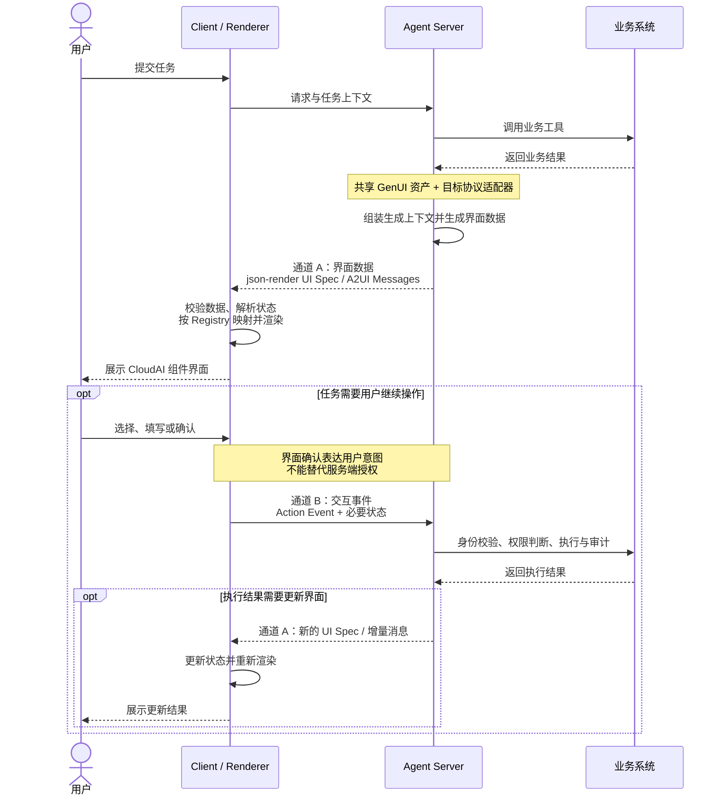

# GenUI：让 Agent 从给出答案走向交付结果

## 一、背景与问题驱动

> 真正卡住体验的不是模型答得好不好，而是结果交付的“最后一公里”： 用户拿到的是一段文字，却需要做的是比较证据、判断风险、然后动手操作。

在 Agentic 用云、管云场景里，用户对结果的要求不止“读懂”： 用户需要横向比较几组证据，判断某个操作的风险，然后在当前上下文里直接把动作执行掉。 现有的两种表达方式均具有局限性：

*   **纯文本** 擅长解释和开放表达，但一旦需要对比多组指标、定位异常时间点、或者发起一个带确认的操作，它的组织能力和操作能力都不够。
    
*   **固定页面** 擅长承载稳定、高频的流程，但它必须提前设计；而 Agent 在运行时产出的结果形态是长尾的，无法提前穷举出对应的页面。
    

GenUI 补上了这段“最后一公里”：由 Agent 依据本次任务的真实结果，动态组织结论、证据和可执行操作， 让用户在对话里看懂发生了什么，并直接继续完成任务。


Markdown


GenUI


## 二、GenUI 的设计思想

**GenUI（Generative UI，生成式 UI）是一套机制**：让 Agent 在运行时依据任务上下文和业务结果， 在受约束的范围内动态组织内容、组件与操作，交由客户端渲染成界面。 它的产物是界面，但它本身是“生成 + 约束 + 渲染”的一条链路，而不是某一张具体的页面。

它不替代自然语言，也不替代固定页面。三者的分工是清晰的： **自然语言**负责开放表达与解释，**固定页面**负责稳定高频的既定流程， **GenUI** 把富表达和富操作延伸到无法提前穷举的长尾任务。


### 共享设计资产：约束 Agent “能用什么”和“该怎么用”

Agent 的生成自由度需由资产约束，否则一致性无从谈起。CloudAI GenUI 把这些约束沉淀为一套**共享设计资产**， 与具体协议无关，由适配层再翻译成各协议的数据契约：


CloudAI 设计资产

| **资产** | **约束什么** | **说明** |
| --- | --- | --- |
| **Catalog** | “能用什么” | 本次任务可用的组件清单及其数据与操作契约，是生成的硬边界。包含通用基础组件、业务组件、语义组合组件（Block） |
| **Template** | “通常怎么组织” | 按常见任务意图给出推荐的信息结构与示例结构，帮助 Agent 收敛组织方式 |
| **使用规则** | “该怎么用” | 信息层级、组件选择、风险提示与操作确认等规则，避免随意拼装 |

> “Catalog” 一词在协议侧也存在（例如 A2UI 用 catalog 表示客户端已声明的可用组件类型集合）。 本文中 **GenUI Catalog** 指跨协议共享的设计资产， **协议侧 catalog** 指由适配层从它生成的、面向某个具体协议与渲染器的组件清单。

最终界面仍由 Agent 根据本次任务的上下文与业务结果动态生成。 之所以“动态”不等于“不可控”，是因为确定性并不来自生成过程，而来自它的三重约束： **Catalog 白名单限定可用元素**、**Schema 校验拦截非法结构**、 **客户端可信组件独占渲染实现**。灵活性归 Agent，确定性归客户端。

### 为什么是声明式，而不是生成界面代码

GenUI 的核心不是让模型直接产出 HTML、JavaScript 或 JSX，而是让 Agent 用结构化数据声明 **“需要呈现什么”**，再由客户端决定**“具体如何呈现”**。

直接生成界面代码有两个绕不过去的问题：一是输出空间是开放的，品牌一致性和交互边界都难以约束； 二是它把模型生成的内容直接送进了可执行边界。面向生产系统，Agent 的输出需要是 **声明式** 的、限定在已知元素内、并且能在渲染前被校验——这就是选择结构化 UI 描述的原因。


这一方式遵循三项原则：

1.  **业务结果与界面表达解耦**：业务结果是事实源，协议数据只负责如何呈现，可以随上下文重新组织。
    
2.  **表达语义与视觉实现解耦**：Agent 选择指标、证据、风险和操作等语义，品牌、布局、样式和交互由客户端的可信组件实现。
    
3.  **设计知识与技术框架解耦**：Component 语义、Block、Template 意图和规则作为共享设计知识，再由适配层转成不同协议的数据契约。
    

## 三、关键特性与优势

### 设计资产提升 GenUI 生成质量

json-render、A2UI 提供生成与渲染机制，shadcn 提供基础组件，但仅有协议和基础组件时，信息层级、组件组合与操作边界仍主要依赖 Agent 临时组织。我们通过 Block、增量 Catalog、Template 与使用规则将设计经验带入生成过程，使 Agent 在动态组织内容的同时，生成结构更清晰、体验更一致、操作边界更明确的产品界面。

Before：基于 shadcn 基础组件直出生成效果


After：接入设计资产后的效果


### 从呈现结果到完成任务

GenUI 不只展示业务结果。当任务需要用户继续参与时，界面可以提供输入、选择、确认和操作入口，并将用户操作回传给 Agent，继续驱动业务执行与界面更新。用户无需离开当前上下文，就能从理解结果自然进入下一步操作，持续推进任务。

Template示例

### 输出可校验，问题可追踪

Agent 输出的是结构化协议数据，而不是可执行的 HTML / JavaScript / JSX。数据先经 Schema 校验，再映射为可信的客户端组件。 这带来三件事：结构问题（未知组件、字段类型错误、引用缺失）在渲染前就能被拦下； 脚本注入与不可预期交互的风险被显著降低；协议数据本身是可记录、可比对的产物，为回放和问题定位留出了接口。

在流式场景下，校验粒度是**按消息、按节点**进行的：渲染器逐条消费增量消息，边校验边渲染， 未通过校验的节点降级或跳过，而不是等整屏数据齐备后才开始渲染。

:::
🌰 **Json Render Case**

:::
Spec

```mysql
{
  "root": "insight",
  "elements": {
    "insight": {
      "type": "InsightBlock",
      "props": {
        "tag": "analysis",
        "title": "慢日志是当前性能问题的主要原因",
        "summary": "实例整体资源充足，慢日志峰值与资源波动同步出现，优先治理高频慢 SQL。"
      },
      "children": [
        "metrics",
        "evidence"
      ]
    },
    "metrics": {
      "type": "Grid",
      "props": {
        "columns": 4,
        "gap": "sm",
        "className": null
      },
      "children": [
        "cpu",
        "memory",
        "connections",
        "locks"
      ]
    },
    "cpu": {
      "type": "MetricCard",
      "props": {
        "badgeText": "CPU 峰值",
        "title": "68%",
        "description": null
      }
    },
    "memory": {
      "type": "MetricCard",
      "props": {
        "badgeText": "内存使用率",
        "title": "61%",
        "description": null
      }
    },
    "connections": {
      "type": "MetricCard",
      "props": {
        "badgeText": "连接使用率",
        "title": "42%",
        "description": null
      }
    },
    "locks": {
      "type": "MetricCard",
      "props": {
        "badgeText": "锁等待",
        "title": "3",
        "description": null
      }
    },
    "evidence": {
      "type": "ChartGroup",
      "props": {
        "title": "慢日志数量",
        "layout": "single"
      },
      "children": [
        "health-chart"
      ]
    },
    "health-chart": {
      "type": "ComboChart",
      "props": {
        "data": [
          {
            "time": "12:00",
            "slowLogs": 2,
            "cpu": 44,
            "memory": 31,
            "connections": 20
          },
          {
            "time": "13:00",
            "slowLogs": 9,
            "cpu": 32,
            "memory": 25,
            "connections": 38
          },
          {
            "time": "14:00",
            "slowLogs": 2,
            "cpu": 28,
            "memory": 33,
            "connections": 30
          },
          {
            "time": "15:00",
            "slowLogs": 3,
            "cpu": 30,
            "memory": 28,
            "connections": 37
          },
          {
            "time": "16:00",
            "slowLogs": 13,
            "cpu": 45,
            "memory": 28,
            "connections": 31
          },
          {
            "time": "17:00",
            "slowLogs": 4,
            "cpu": 18,
            "memory": 39,
            "connections": 30
          }
        ],
        "categoryKey": "time",
        "barSeries": {
          "key": "slowLogs",
          "label": "慢日志数量",
          "colorToken": "chart-1"
        },
        "lineSeries": [
          {
            "key": "cpu",
            "label": "CPU",
            "colorToken": "chart-4"
          },
          {
            "key": "memory",
            "label": "内存",
            "colorToken": "chart-3"
          },
          {
            "key": "connections",
            "label": "连接",
            "colorToken": "chart-2"
          }
        ],
        "height": 240,
        "showGrid": true,
        "showLegend": true,
        "xAxisInterval": null,
        "leftDomain": [
          0,
          16
        ],
        "rightDomain": [
          0,
          100
        ],
        "rightUnit": "%"
      }
    }
  }
}
```
:::
:::
渲染效果


:::
:::

## 四、运行机制与数据流 

对于需要用户继续操作的任务，运行时由两条方向相反的数据通道共同形成闭环：Server → Client 负责交付界面数据，Client → Server 负责回传交互事件。前者让结果可理解，后者让用户操作继续驱动业务执行与界面更新。

**通道 A**

### Server → Client：界面数据

Agent Server 依据业务结果、共享设计资产和目标协议生成界面数据：json-render 交付 UI Spec，A2UI 交付协议消息。Client 负责校验、解析状态；Renderer 根据 Registry 中的映射组织并渲染 CloudAI 组件。

**通道 B**

### Client → Server：交互事件

用户操作被组装为 Action Event，连同必要状态回传。**鉴权、执行与审计一律发生在服务端**——界面上的确认只是意图表达，不构成授权。执行结果若改变界面，再经通道 A 回流。



具体传输方式由协议和业务宿主决定。A2UI 可以通过流式消息持续更新 Surface；json-render 不限定网络传输方式，由宿主负责传递 Spec 与交互事件。 两者共享的是设计语义与使用规则，**不是同一份可直接互换的 JSON**。

## 五、应用场景

GenUI 是 Agentic 用云、管云的体验基座，帮助 Agent 将动态业务结果转化为可理解、可操作的界面。以下是三个数据库AIDBS产品中的落地场景：

➊ **诊断与运维**

呈现诊断摘要、异常指标、证据、方案对比与高风险操作确认


➋ **数据查询与业务分析**

动态组织结论、数据对象、知识依据、指标、图表和查询入口


**➌ 售卖**

在对话中完成需求澄清、方案选择、参数调整、确认和下单全流程


## 六、边界与限制

> GenUI 的价值域是长尾任务。把它用到不该用的地方，代价是稳定性和成本； 对它的能力做过强假设，代价是信任。

### 什么时候不该用 GenUI

*   **稳定、高频、强流程的操作**：走固定页面。这类流程的最优形态可以被提前设计，没有必要在运行时重新组织。
    
*   **纯解释性、开放式的回答**：走自然语言。为一段解释套上组件只会增加噪声。
    
*   **强合规、强事务、字段极多的复杂配置**：走控制台。这类界面对校验规则和状态机的要求超出生成式组织的可靠区间。
    

### 能力边界

*   **结构可校验，事实不可校验：**Schema 能拦住未知组件与字段错误，拦不住被编造的数值或不成立的结论。数值必须来自业务系统返回，结论需要可溯源的证据，必要时由业务侧做二次核对。
    
*   **界面确认不等于授权：**所有鉴权、执行与审计都在服务端完成；客户端的确认交互只表达用户意图。
    
*   **成本与延迟是真实约束：**Spec 体积直接影响首屏时间与 Token 成本，复杂界面依赖流式生成与增量更新才能获得可接受的感知性能。
    
*   **跨协议不可直接互换：**共享的是设计语义与使用规则；不同协议的数据契约由适配层各自生成。
    
*   **依赖的协议本身仍在演进：**A2UI 目前仍处于活跃演进阶段（稳定线为 v0.9 系列，v1.0 为候选版本），OpenUI 生态同样在迭代。因此 GenUI 采取“资产稳定、适配层承接变化”的策略，把协议波动隔离在业务语义之外。
    

## 七、技术路线与后续演进

我们的路线策略是**共享资产、兼容多种技术路径**：Component、Block、Catalog、Template 与使用规则保持稳定， 由适配层对接不同的数据契约与 Renderer。

以下是三条主要技术路径：

| **路径** | **形态** | **状态** | **当前进展** | **下一步** |
| --- | --- | --- | --- | --- |
| **json-render** | UI Spec + 渲染器 | **已打通** | 生成、校验、渲染链路闭环 | 拓展真实业务验证 |
| [**A2UI**](https://a2ui.org/) | 声明式 UI 协议（流式 JSON 消息） | **进行中** | 已在业务场景完成验证，CloudAI 设计资产适配中 | 完成 Catalog 与组件映射 |
| [**OpenUI（OpenUI Lang）**](https://www.openui.com/docs/openui-lang) | 生成式 UI 框架 + 面向 LLM 的行式 DSL | **规划中** | 已纳入兼容规划，尚未接入 | 开展技术验证与 CloudAI 资产映射 |

后续重点评估四个维度：

*   **生成与体验**：结构有效率、业务完整度、组件选择和任务完成体验；
    
*   **交互与性能**：流式生成、增量更新、多轮状态、首屏时间和 Token 成本；
    
*   **安全与可观测**：Schema 校验、权限审计、容错降级、链路追踪和回放；
    
*   **兼容与接入**：资产覆盖度、适配维护成本、跨端复用和业务接入成本。
    

## 八、术语解释

| **术语** | **含义** |
| --- | --- |
| **Agent Server** | 理解意图、调用业务工具、并生成界面数据的服务端。所有鉴权、执行与审计都在这里发生。 |
| **Client / Renderer** | 接收协议数据、完成校验与状态解析、并把节点渲染为本地组件的客户端与渲染器。 |
| **Registry** | 协议中的组件类型到本地组件实现的注册映射表，是客户端侧的白名单落点。 |
| **Spec** | json-render 中描述一屏界面的结构化数据：`root` 指定入口，`elements` 以扁平字典 + id 引用组织节点树。 |
| **Surface** | A2UI 中承载组件的画布单元（如主视图、侧栏、弹窗），可被增量消息持续更新。 |
| **Action Event** | 客户端把用户的选择、填写、确认或操作连同当前状态组装成的事件，回传服务端触发执行。 |
| **CloudAI 组件** | 客户端侧经过设计与安全审核的可信组件库，是所有 GenUI 界面的唯一渲染实现来源。 |
| **Schema 校验** | 渲染前对协议数据做的结构校验：组件是否已知、字段类型是否正确、引用是否完整。不校验业务事实。 |
